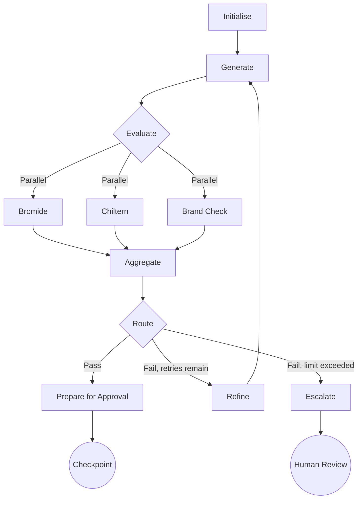
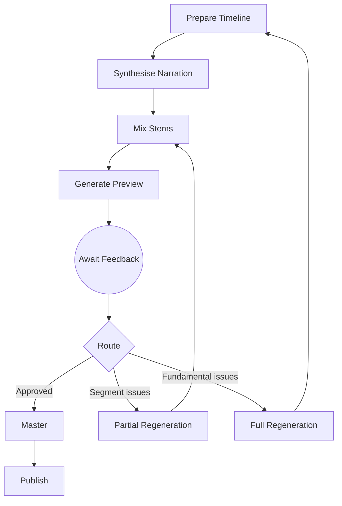

# Episodic Podcast Generation System Design

## Overview

The episodic podcast generation platform automates the production of scripted,
branded audio shows. It ingests heterogeneous source documents, synthesises
canonical TEI content, applies layered quality assurance, and renders broadcast
quality audio with background music before exposing approvals and delivery
channels.

## Goals

- Maintain a canonical, auditable TEI corpus for each series and episode.
- Enable configurable generation that respects show templates and brand tone.
- Provide multi-stage human-in-the-loop approvals with clear accountability.
- Deliver mastered audio assets together with previews and machine-readable
  metadata.
- Operate on cloud-native infrastructure with automation, observability, and
  compliance controls.

## Non-Goals

- Building a generic content management system outside the podcast domain.
- Supporting real-time streaming or live recording use cases.
- Implementing on-premises deployments beyond documented infrastructure
  blueprints.

## Personas and Actors

- **Editorial producers** curate source material, trigger generation, and
  approve episodes.
- **Compliance reviewers** verify brand and regulatory adherence.
- **Audio engineers** tune voice configurations, music beds, and stem mixes.
- **Developers and operators** maintain services, pipelines, and infrastructure.
- **Integration clients** consume the API, CLI, or web console to orchestrate
  workflows programmatically.

## Architectural Summary

The system follows a hexagonal architecture: domain services expose ports, and
adapters integrate external capabilities such as LLMs, TTS vendors, and
storage. Services communicate through asynchronous events (Kafka) and
synchronous gRPC or REST calls. Persistent state lives in Postgres with Alembic
migrations. Object storage holds binary assets. GitOps drives deployments into
Kubernetes across sandbox, staging, and production environments.

The Content Generation Orchestrator and Audio Synthesis Pipeline employ
LangGraph as the agentic orchestration framework. LangGraph StateGraphs manage
iterative refinement cycles, enabling feedback from QA evaluators to drive
regeneration rather than merely gating content. Conditional edges route
workflows based on evaluation outcomes, whilst human-in-the-loop checkpoints
support editorial approvals at configurable stages. Persistence and
checkpointing provide resumable workflows that survive service restarts and
enable long-running editorial review periods.

## Component Responsibilities

### Canonical Content Platform

- Defines TEI-based domain entities for episodes, series profiles, and
  templates.
- Hosts the Postgres schema, repositories, and unit-of-work abstractions.
- Generates TEI header provenance automatically, including ingested sources,
  weighting decisions, and reviewer metadata.

### Multi-source Ingestion Service

- Accepts RSS feeds, briefs, transcripts, press releases, and research notes.
- Applies document classifiers, quality scores, and weighting heuristics to
  establish priority when sources conflict.
- Normalises inputs into TEI fragments, merging them into canonical episodes
  while recording provenance and retaining source attachments.
- Exposes ingestion job status via API endpoints and emits events for downstream
  processing.

### Series Profile and Template Service

- Stores show-level configuration: tone descriptors, recurring segments, and
  sponsor requirements.
- Manages episode templates describing segment ordering, timing, and audio bed
  preferences.
- Provides change history and optimistic locking so editorial teams can iterate
  safely.
- Supplies templated prompts and metadata to generation and audio pipelines.

### Content Generation Orchestrator

- Coordinates `LLMPort` adapters with retry discipline, token budgeting, and
  guardrails per template.
- Employs LangGraph StateGraphs to manage generation state, enabling iterative
  refinement cycles driven by QA feedback.
- Implements conditional edges that route content based on Bromide and Chiltern
  evaluation scores: drafts exceeding thresholds proceed to approval, whilst
  those below threshold re-enter generation with targeted remediation prompts.
- Supports parallel branches for multi-evaluator QA, allowing factual accuracy,
  narrative flow, and brand compliance checks to execute concurrently before
  aggregating results.
- Produces structured drafts, show notes, chapter markers, and sponsorship copy.
- Persists generation runs alongside prompts, responses, iteration counts, and
  cost telemetry.
- Exposes human-in-the-loop checkpoints where editors can intervene, approve, or
  redirect the generation graph mid-cycle.
- Provides checkpointing for resumable workflows, enabling long-running
  editorial review periods without state loss.
- Surfaces retryable failure modes and exposes override hooks for human edits.

### Quality Assurance Stack

- Bromide evaluates factual accuracy, voice consistency, and bias mitigation,
  returning structured findings with severity levels and remediation guidance.
- Chiltern rates narrative flow, pacing, and call-to-action placement, producing
  quantitative scores and qualitative suggestions.
- Brand guideline checks enforce vocabulary, tone, and forbidden topic rules.
- QA evaluators operate as LangGraph nodes, enabling parallel execution within
  the generation StateGraph.
- Evaluation results drive conditional routing: passing scores advance content
  to approval, whilst failing scores trigger re-entry into generation with
  targeted prompts derived from QA findings.
- Aggregation logic combines multi-evaluator results, applying configurable
  policies (all must pass, weighted scoring, or majority rules) before routing
  decisions.
- QA results persist alongside generation runs, providing audit trails of
  iteration history and improvement trajectories.
- Automatic gating and review task escalation remain available for workflows
  that require human intervention after repeated failures.

### Editorial Approval Service

- Implements the configurable approval state machine with stage SLAs.
- Logs reviewer decisions, comments, and attachments per transition.
- Issues notifications via email, Slack, and webhooks to keep stakeholders
  informed.
- Integrates with the CLI and web console so approvals can be performed
  consistently across surfaces.

### Audio Synthesis Pipeline

- Uses `TTSPort` to request narration voiceovers with persona controls and
  resilience to latency, quota, and failure scenarios.
- Constructs timelines combining narration, background music, and sound effect
  stems drawn from managed catalogues.
- Executes automated mixing: ducking, crossfades, EQ presets, and loudness
  normalisation to -16 LUFS +/- 1 LU.
- Employs a LangGraph StateGraph for preview-feedback-regeneration cycles:
  - Initial synthesis produces low-bitrate previews for stakeholder review.
  - Human-in-the-loop checkpoints capture audio engineer feedback on pacing,
    pronunciation, music balance, or segment timing.
  - Conditional edges route approved previews to mastering or return rejected
    segments to narration regeneration with updated parameters.
- Supports partial regeneration, allowing individual segments to be re-rendered
  without reprocessing the entire episode.
- Publishes previews through `PreviewPublisherPort` and delivers masters to CDN
  storage with chapter metadata embedded.
- Checkpointing enables pause-and-resume for audio review workflows spanning
  multiple sessions.

### Client Experience Layer

- REST and GraphQL APIs expose domain resources with RBAC enforcement.
- CLI client provides ergonomics for ingest, generate, QA review, and approval
  commands.
- Web console surfaces dashboards, approval queues, and configuration editors.

### Observability and Operations Platform

- Collects structured logs, metrics, and traces (Grafana, Loki, Tempo, and
  OpenTelemetry).
- Defines SLIs for ingestion latency, generation success, audio throughput, and
  approval turnaround.
- Automates rollbacks, blue/green deployments, and incident response runbooks.

### Security and Compliance Controls

- Enforces fine-grained RBAC, tenancy isolation, and audited secret rotations.
- Performs dependency and container scanning in CI, plus runtime policy checks.
- Tracks GDPR data processing records and supports SOC 2 evidence collection.

## Agent Graph Architecture

The platform employs LangGraph to implement agentic workflows that transcend
simple linear pipelines. This section describes the graph architecture and its
integration with the hexagonal design.

### LangGraph Integration Principles

LangGraph serves as an internal orchestration mechanism within the Content
Generation Orchestrator and Audio Synthesis Pipeline. It does not replace the
hexagonal architecture but rather provides structured control flow for
iterative, feedback-driven processes. Key principles include:

- **Ports remain the integration boundary.** LangGraph graphs invoke `LLMPort`,
  `TTSPort`, and evaluator ports; the graph itself does not expose external
  integration points.
- **StateGraphs encapsulate workflow state.** Each generation or synthesis run
  maintains a StateGraph instance holding draft content, evaluation scores,
  iteration counts, and routing decisions.
- **Conditional edges encode business rules.** Threshold checks, retry limits,
  and escalation policies manifest as edge conditions rather than scattered
  if-else logic.
- **Human-in-the-loop checkpoints pause execution.** Editorial approvals,
  redlines, and audio feedback integrate as interruptible graph nodes with
  persistence.

### Content Generation Graph

The content generation workflow operates as a cyclic StateGraph with the
following node structure:

1. **Initialise:** Load series profile, episode template, and canonical TEI
   sources; construct the initial prompt scaffold.
2. **Generate:** Invoke `LLMPort` to produce draft content, show notes, and
   enrichments.
3. **Evaluate (parallel branch):** Execute Bromide, Chiltern, and brand
   compliance checks concurrently; aggregate results.
4. **Route:** Conditional edge based on evaluation outcome:
   - If all evaluators pass thresholds, proceed to **Prepare for Approval**.
   - If evaluators fail but iteration count is below limit, proceed to
     **Refine**.
   - If iteration limit exceeded, proceed to **Escalate**.
5. **Refine:** Construct remediation prompts from QA findings; return to
   **Generate**.
6. **Prepare for Approval:** Package content for human review; create
   checkpoint.
7. **Escalate:** Create review tasks for human intervention; pause graph.

The following diagram illustrates the content generation graph:

### Audio Synthesis Graph

The audio synthesis workflow follows a similar pattern with preview-driven
feedback loops:

1. **Prepare Timeline:** Retrieve approved script, select voice personas, and
   schedule music beds.
2. **Synthesise Narration:** Invoke `TTSPort` for each segment; handle retries
   and fallback voices.
3. **Mix Stems:** Combine narration, music, and effects; apply ducking and
   normalisation.
4. **Generate Preview:** Produce low-bitrate preview for stakeholder review.
5. **Await Feedback (checkpoint):** Pause for audio engineer or producer input.
6. **Route:** Conditional edge based on feedback:
   - If approved, proceed to **Master**.
   - If segment-level issues, proceed to **Partial Regeneration**.
   - If fundamental issues, proceed to **Full Regeneration**.
7. **Partial Regeneration:** Re-synthesise specific segments; return to **Mix
   Stems**.
8. **Full Regeneration:** Return to **Prepare Timeline** with updated
   parameters.
9. **Master:** Produce final audio, embed metadata, and publish.

The following diagram illustrates the audio synthesis graph:

### State Persistence and Checkpointing

LangGraph checkpointing integrates with the platform's Postgres storage:

- **Checkpoint tables** store serialised graph state, keyed by episode ID and
  workflow type.
- **Resume semantics** allow workflows interrupted by service restarts, long
  human review periods, or failures to continue from the last checkpoint.
- **Audit integration** links checkpoint events to `approval_events` and
  generation run histories.
- **TTL policies** expire stale checkpoints after configurable periods to
  prevent unbounded storage growth.

### Configuration and Tunables

Agentic workflow behaviour is configurable per series profile:

- **Maximum iteration count:** Limits regeneration cycles before escalation
  (default: 3).
- **Evaluation thresholds:** Per-evaluator pass/fail scores (e.g., Bromide
  accuracy >= 0.85).
- **Aggregation policy:** How multi-evaluator results combine (all-pass,
  weighted, majority).
- **Checkpoint TTL:** Duration before abandoned workflows expire.
- **Parallel evaluation toggle:** Enable or disable concurrent evaluator
  execution.

## Data Model and Storage

- `series_profiles` captures show metadata, tone attributes, default voices, and
  sponsor obligations.
- `episode_templates` stores segment layouts, prompt scaffolds, and music bed
  preferences linked to series profiles.
- `source_documents` records ingestion jobs, document types, weighting factors,
  and original files in object storage.
- `episodes` holds canonical TEI, generation status, QA verdicts, and approval
  pointers.
- `qa_findings` and `brand_compliance_results` record scores, rule breaches, and
  remediation guidance.
- `approval_events` maintains the approval state machine history with actor and
  timestamp.
- `generation_iterations` records each generation cycle within a StateGraph run,
  including prompts, responses, evaluator scores, routing decisions, and
  timestamps.
- `workflow_checkpoints` stores serialised LangGraph state for resumable
  workflows, keyed by episode ID, workflow type (generation or synthesis), and
  checkpoint timestamp.
- `audio_feedback` captures stakeholder comments on preview segments, linked to
  synthesis graph checkpoints and driving routing decisions.
- Alembic migrations version schema changes; migrations run in CI and during
  deployments to guarantee consistency.

## Core Workflows

### Multi-source Ingestion and Prioritisation

1. Producer submits new sources through the API or scheduled connectors.
2. Ingestion service classifies documents, computes freshness and reliability
   scores, and applies weighting heuristics defined per series.
3. Conflicts resolve using the weighting matrix; rejected content is retained
   for audit.
4. Normalised TEI fragments merge into the canonical episode; provenance is
   logged and downstream events trigger generation.

### Episode Generation and Enrichment

1. Orchestrator initialises a LangGraph StateGraph, loading the latest series
   profile and episode template to derive prompt scaffolds.
2. `LLMPort` adapters invoke selected models, respecting token budgets and retry
   policies; the graph captures generated content in state.
3. Bromide, Chiltern, and brand compliance evaluators execute in parallel as
   graph nodes, producing structured findings.
4. Conditional edges route based on aggregated evaluation scores:
   - Passing scores advance content to the approval checkpoint.
   - Failing scores trigger refinement: the graph constructs targeted prompts
     from QA findings and re-enters generation.
   - Repeated failures escalate to human review with accumulated context.
5. Generated artefacts persist alongside confidence scores, iteration counts,
   and content hashes.
6. Human-in-the-loop checkpoints pause the graph for editorial review; editors
   may approve, request changes, or override evaluation decisions.
7. Editors receive drafts in the console or CLI for optional redlines; approved
   content proceeds to audio synthesis.

### QA, Compliance, and Approvals

1. QA evaluation occurs as an integrated phase of the generation StateGraph
   rather than a separate downstream step.
2. Bromide and Chiltern analyse drafts within the graph, producing structured
   findings with severity levels and remediation suggestions.
3. Brand guideline checks run lexicon scans, sentiment analysis, and sponsor
   requirement validation as concurrent graph nodes.
4. Aggregated results drive conditional routing: passing content proceeds to
   approval checkpoints, failing content re-enters generation with targeted
   remediation prompts.
5. Repeated failures (exceeding configured iteration limits) create escalation
   tasks for human intervention, preserving the full iteration history for
   context.
6. Content passing QA transitions into the approval state machine; reviewers
   complete approvals within SLA windows.
7. Every evaluation, routing decision, and approval emits audit events,
   providing full traceability of the content journey.

### Audio Synthesis and Distribution

1. Approved scripts initialise an Audio Synthesis StateGraph, which prepares
   timelines and selects voice personas from series profile configuration.
2. `TTSPort` synthesises narration segments with configured resilience policies;
   the graph tracks segment completion in state.
3. Music supervisor rules choose background beds and stings based on template
   cues; stems assemble into the mixing timeline.
4. Mixer combines narration and stems, runs loudness normalisation, and produces
   a low-bitrate preview.
5. The graph pauses at a feedback checkpoint, publishing the preview via signed
   URLs for audio engineer and producer review.
6. Stakeholders provide feedback through the console or CLI; the graph routes
   based on feedback type:
   - Approved previews proceed to mastering.
   - Segment-level issues (pronunciation, pacing) trigger partial regeneration
     of specific segments.
   - Fundamental issues (voice selection, music bed) trigger full regeneration
     with updated parameters.
7. Mastering produces final audio with embedded chapter markers and metadata.
8. Masters replicate to CDN and RSS integrations; the graph completes and
   persists final state.

### Change Management and Migrations

1. Schema updates originate as Alembic migrations committed with code changes.
2. CI validates migrations against an ephemeral Postgres instance.
3. Deployments apply migrations through GitOps jobs with automated rollback if
   checks fail.

## Operational Considerations

- **Infrastructure:** Kubernetes clusters span sandbox, staging, and production;
  supporting services include Postgres, Redis, and object storage. Terraform
  codifies provisioning and aligns with the Phase 0 roadmap milestone.
- **Deployment:** GitOps (Argo CD) manages environment parity, progressive
  delivery, and secrets injected via SOPS and age.
- **Observability:** Metrics power SLO dashboards; tracing correlates ingestion
  to audio rendering; alerting integrates with Slack and PagerDuty.
- **Resilience:** Services use idempotent operations, retries with backoff, and
  dead-letter queues for failed messages; disaster recovery rehearsals validate
  backups and restore paths.

## Roadmap Alignment

- Phase 0 establishes the infrastructure blueprint described in Operational
  Considerations.
- Phase 1 implements the canonical content platform, ingestion service, and
  series/template storage defined above.
- Phase 2 delivers the content generation orchestrator with LangGraph-based
  agentic workflows, the QA stack as integrated evaluation nodes, and brand
  compliance automation with feedback-driven refinement loops.
- Phase 3 realises the audio synthesis pipeline with preview-feedback-
  regeneration cycles, including music integration and checkpoint-enabled
  stakeholder review.
- Phase 4 activates the client experience layer and editorial approval service,
  exposing graph checkpoints through API and console interfaces.
- Phase 5 rounds out security, compliance, and operational automation in line
  with the specified controls.
