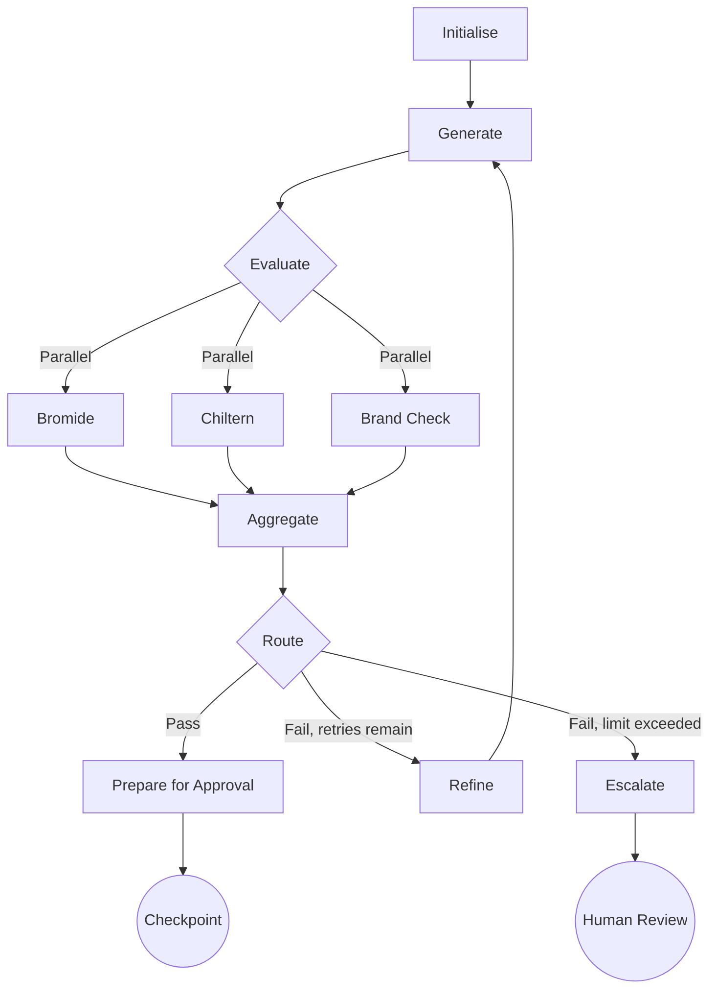
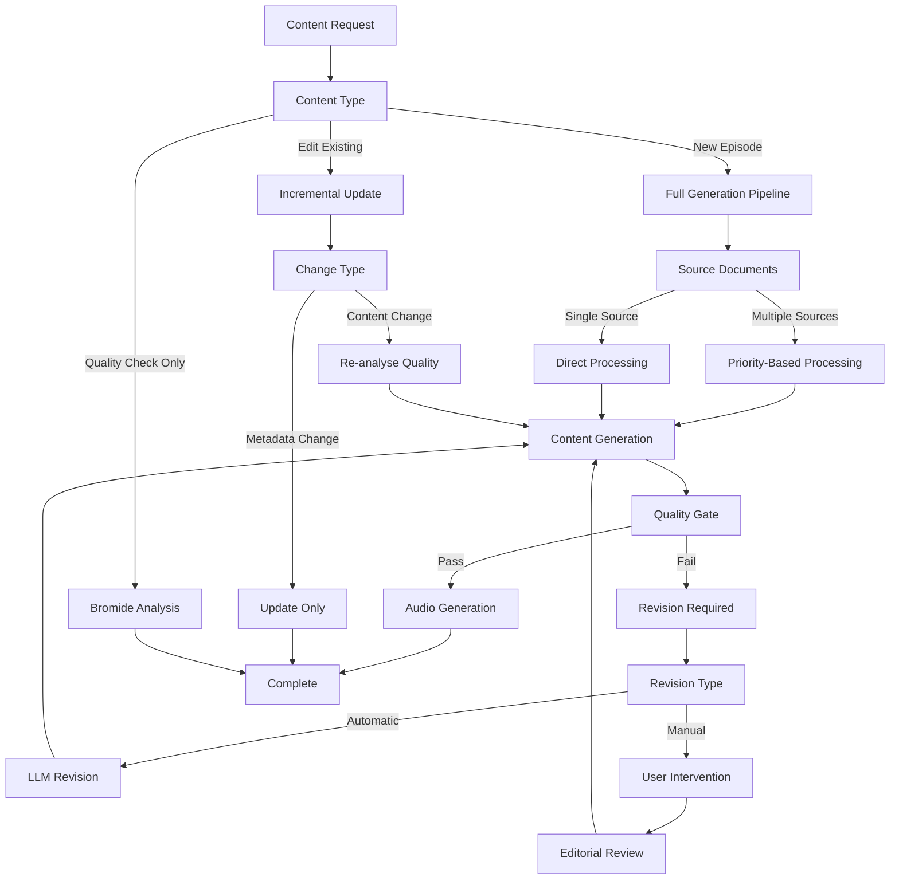
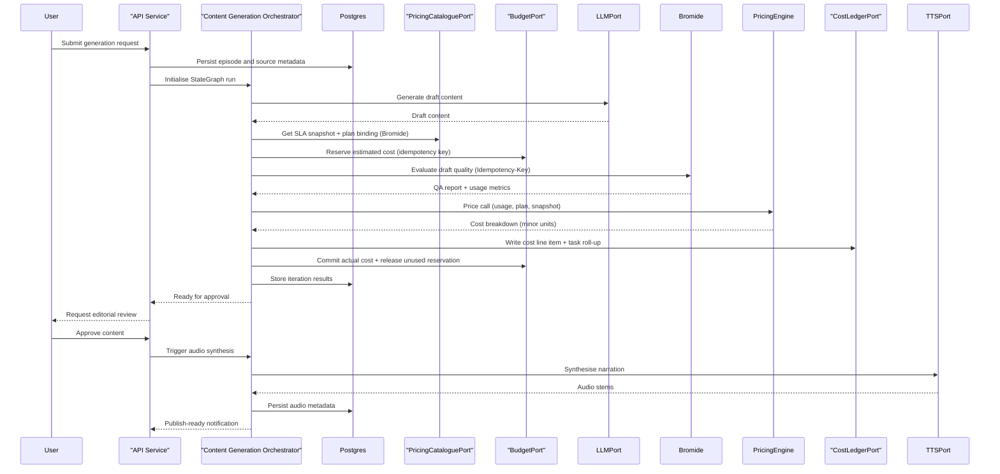
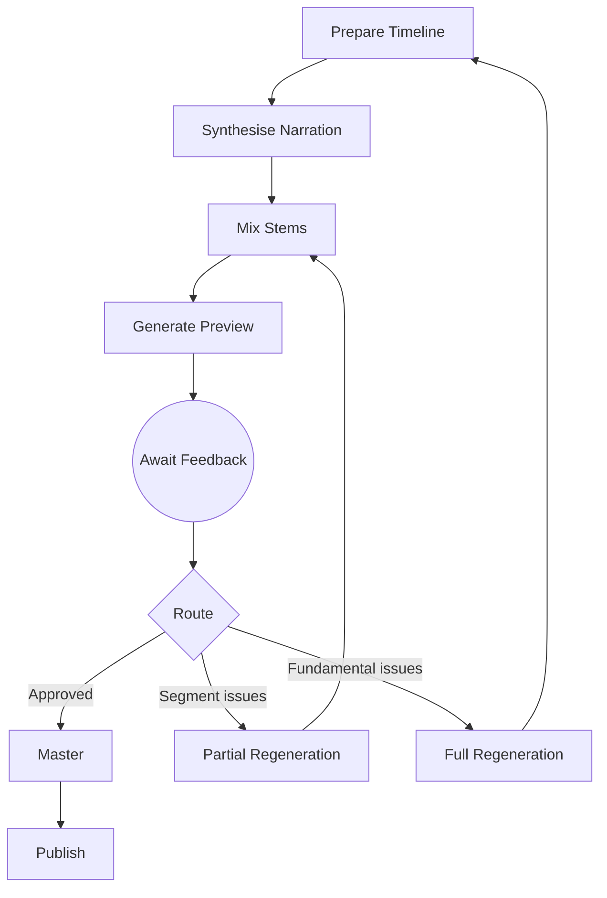
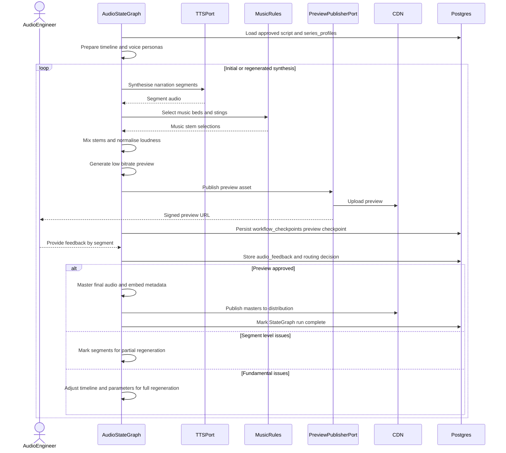
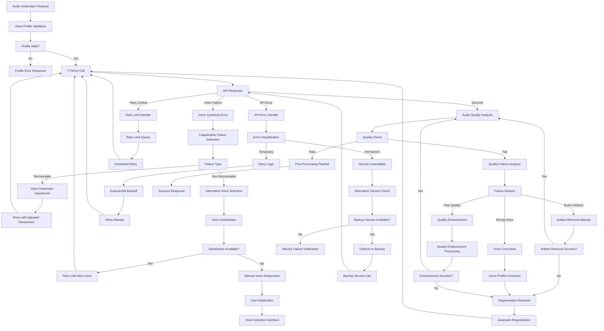
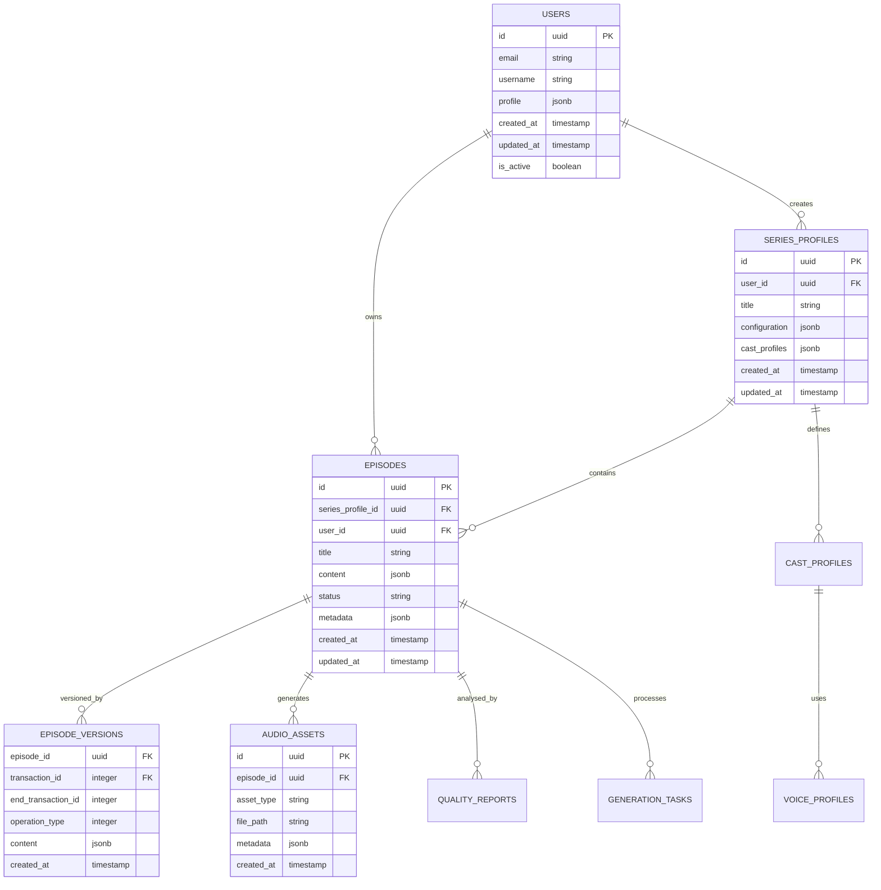
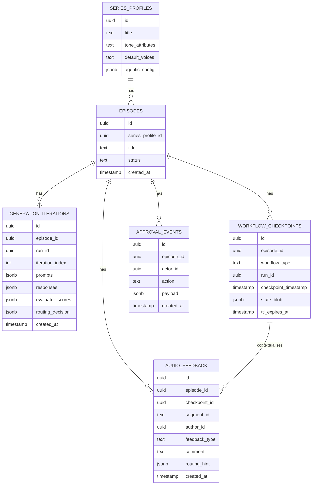
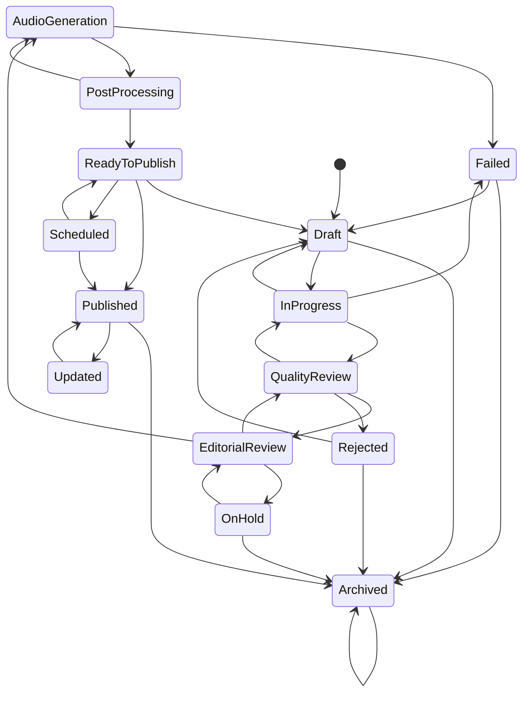

# Episodic Podcast Generation System Design

## Overview

The episodic podcast generation platform automates the production of scripted,
branded audio shows. It ingests heterogeneous source documents, synthesises
canonical Text Encoding Initiative (TEI) content, applies layered quality
assurance, and renders broadcast quality audio with background music before
exposing approvals and delivery channels.

## Goals

- Maintain a canonical, auditable TEI corpus for each series and episode.
- Enable configurable generation that respects show templates and brand tone.
- Provide multi-stage human-in-the-loop approvals with clear accountability.
- Deliver mastered audio assets together with previews and machine-readable
  metadata.
- Operate on cloud-native infrastructure with automation, observability, and
  compliance controls.

## Non-Goals

- Building a generic content management system outside the podcast domain.
- Supporting real-time streaming or live recording use cases.
- Implementing on-premises deployments beyond documented infrastructure
  blueprints.

## Personas and Actors

- **Editorial producers** curate source material, trigger generation, and
  approve episodes.
- **Compliance reviewers** verify brand and regulatory adherence.
- **Audio engineers** tune voice configurations, music beds, and stem mixes.
- **Developers and operators** maintain services, pipelines, and infrastructure.
- **Integration clients** consume the API, command-line interface (CLI), or web
  console to orchestrate workflows programmatically.

## Architectural Summary

The system follows a hexagonal architecture: domain services expose ports, and
adapters integrate external capabilities such as LLMs, TTS vendors, and
storage. HTTP services are delivered with Falcon 4.2.x running on Granian, and
background tasks are handled by Celery with RabbitMQ as the durable broker and
Valkey (Redis-compatible) as the result backend. Services communicate through
asynchronous messaging and synchronous HTTP or gRPC calls. Persistent state
lives in Postgres with Alembic migrations. Object storage holds binary assets.
GitOps drives deployments into Kubernetes across sandbox, staging, and
production environments.

LangGraph provides the control plane for orchestration state, routing
decisions, and resumable checkpoints, whilst Celery workers form the data plane
for blocking or compute-heavy execution. Routing keys map I/O-bound tasks to
high-concurrency pools (gevent or eventlet) and CPU-bound tasks to prefork
pools, keeping long-running work from blocking orchestration throughput.

The Content Generation Orchestrator and Audio Synthesis Pipeline employ
LangGraph as the agentic orchestration framework. LangGraph StateGraphs manage
iterative refinement cycles, enabling feedback from QA evaluators to drive
regeneration rather than merely gating content. Conditional edges route
workflows based on evaluation outcomes, whilst human-in-the-loop checkpoints
support editorial approvals at configurable stages. Persistence and
checkpointing provide resumable workflows that survive service restarts and
enable long-running editorial review periods.

### Hexagonal architecture enforcement

Hexagonal architecture is treated as an enforced boundary rather than a
convention. The system adopts explicit guardrails so that domain logic remains
framework-agnostic and adapters remain replaceable.

Boundary rules:

- **Domain** modules contain business logic and port contracts, without direct
  dependencies on transport, storage, or vendor SDKs.
- **Ports** define typed interfaces and domain error models; adapters implement
  ports rather than leaking infrastructure concerns into the domain.
- **Inbound adapters** (Falcon HTTP, CLI, scheduler entrypoints) depend on the
  domain and ports, but never on outbound adapter implementations.
- **Outbound adapters** (database, object storage, message broker, LLM/TTS
  vendors) depend on the domain and ports, but never on inbound adapters.
- **Orchestration code** (LangGraph nodes and Celery tasks) depends on domain
  services and ports only; direct adapter access is forbidden.
- **Cross-adapter imports** are forbidden; interactions happen through ports or
  well-defined message schemas.
- **Checkpoint payloads** hold orchestration metadata; canonical domain state
  is persisted through repositories rather than state blobs.

Enforcement mechanisms:

- Lint rules and import conventions flag forbidden dependency direction
  (e.g. inbound or outbound modules importing each other).
- Architecture tests validate the allowed dependency graph and port contract
  adherence as part of `make test`.
- Architecture tests cover LangGraph node and Celery task imports, enforcing
  port-only dependencies for orchestration code.
- Contract tests exercise port behaviour against adapter implementations, so
  adapters are verified without coupling to infrastructure in the domain.
- Code review checklists enforce idempotency keys, single-responsibility task
  scope, and checkpoint payload audits for orchestration changes.

#### Orchestration guardrails

The following rules are normative for LangGraph nodes and Celery tasks:

- Orchestration code depends on domain services and ports only; adapters are
  accessed exclusively through port interfaces.
- Celery tasks are single-responsibility and idempotent, with idempotency keys
  persisted per task or workflow step.
- Checkpoint payloads store orchestration metadata only; canonical domain data
  is persisted through repositories and tables.
- Long-running tasks that gate routing use the suspend-and-resume pattern;
  fire-and-forget tasks are reserved for side effects.

## Component Responsibilities

### Canonical Content Platform

- Defines TEI-based domain entities for episodes, series profiles, and
  templates.
- Hosts the Postgres schema, repositories, and unit-of-work abstractions.
- Generates TEI header provenance automatically, including ingested sources,
  weighting decisions, and reviewer metadata.

### Multi-source Ingestion Service

- Accepts Really Simple Syndication (RSS) feeds, briefs, transcripts, press
  releases, and research notes.
- Applies document classifiers, quality scores, and weighting heuristics to
  establish priority when sources conflict.
- Normalises inputs into TEI fragments, merging them into canonical episodes
  while recording provenance and retaining source attachments.
- Exposes ingestion job status via API endpoints and emits events for downstream
  processing.

### Series Profile and Template Service

- Stores show-level configuration: tone descriptors, recurring segments, and
  sponsor requirements.
- Manages episode templates describing segment ordering, timing, and audio bed
  preferences.
- Provides change history and optimistic locking so editorial teams can iterate
  safely.
- Supplies templated prompts and metadata to generation and audio pipelines.

### Content Generation Orchestrator

- Coordinates `LLMPort` adapters with retry discipline, token budgeting, and
  guardrails per template.
- Employs LangGraph StateGraphs to manage generation state, enabling iterative
  refinement cycles driven by QA feedback.
- Implements conditional edges that route content based on Bromide and Chiltern
  evaluation scores: drafts exceeding thresholds proceed to approval, whilst
  those below threshold re-enter generation with targeted remediation prompts.
- Supports parallel branches for multi-evaluator QA, allowing factual accuracy,
  narrative flow, and brand compliance checks to execute concurrently before
  aggregating results.
- Produces structured drafts, show notes, chapter markers, and sponsorship copy.
- Persists generation runs alongside prompts, responses, iteration counts, and
  cost telemetry.
- Records per-task roll-ups and per-call cost line items via `CostLedgerPort`,
  pinning pricing snapshots for helper services and vendors to support
  auditability and dispute resolution.
- Enforces per-episode budgets through `BudgetPort` using reservation and
  reconciliation semantics (reserve → commit → release) around billable calls.
- Exposes human-in-the-loop checkpoints where editors can intervene, approve, or
  redirect the generation graph mid-cycle.
- Provides checkpointing for resumable workflows, enabling long-running
  editorial review periods without state loss.
- Surfaces retryable failure modes and exposes override hooks for human edits.

### Quality Assurance Stack

- Bromide evaluates factual accuracy, voice consistency, and bias mitigation,
  returning structured findings with severity levels and remediation guidance.
- Chiltern rates narrative flow, pacing, and call-to-action placement, producing
  quantitative scores and qualitative suggestions.
- Brand guideline checks enforce vocabulary, tone, and forbidden topic rules.
- Evaluator services publish machine-discoverable pricing contracts via OpenAPI
  `info.x-sla`, pointing to an SLA4OAI (Service-Level Agreements for OpenAPI)
  plan document that defines metrics and pricing rules.
- QA evaluators operate as LangGraph nodes, enabling parallel execution within
  the generation StateGraph.
- Evaluation results drive conditional routing: passing scores advance content
  to approval, whilst failing scores trigger re-entry into generation with
  targeted prompts derived from QA findings.
- Aggregation logic combines multi-evaluator results, applying configurable
  policies (all must pass, weighted scoring, or majority rules) before routing
  decisions.
- QA results persist alongside generation runs, providing audit trails of
  iteration history and improvement trajectories.
- Automatic gating and review task escalation remain available for workflows
  that require human intervention after repeated failures.

### Editorial Approval Service

- Implements the configurable approval state machine with stage service-level
  agreement (SLA) targets.
- Logs reviewer decisions, comments, and attachments per transition.
- Issues notifications via email, Slack, and webhooks to keep stakeholders
  informed.
- Integrates with the CLI and web console so approvals can be performed
  consistently across surfaces.

### Audio Synthesis Pipeline

- Uses `TTSPort` to request narration voiceovers with persona controls and
  resilience to latency, quota, and failure scenarios.
- Constructs timelines combining narration, background music, and sound effect
  stems drawn from managed catalogues.
- Executes automated mixing: ducking, crossfades, EQ presets, and loudness
  normalisation to -16 LUFS +/- 1 LU.
- Employs a LangGraph StateGraph for preview-feedback-regeneration cycles:
  - Initial synthesis produces low-bitrate previews for stakeholder review.
  - Human-in-the-loop checkpoints capture audio engineer feedback on pacing,
    pronunciation, music balance, or segment timing.
  - Conditional edges route approved previews to mastering or return rejected
    segments to narration regeneration with updated parameters.
- Supports partial regeneration, allowing individual segments to be re-rendered
  without reprocessing the entire episode.
- Publishes previews through `PreviewPublisherPort` and delivers masters to CDN
  storage with chapter metadata embedded.
- Checkpointing enables pause-and-resume for audio review workflows spanning
  multiple sessions.

### Client Experience Layer

- REST and GraphQL APIs expose domain resources with RBAC enforcement, served
  via Falcon 4.2.x on Granian.
- CLI client provides ergonomics for ingest, generate, QA review, and approval
  commands.
- Web console surfaces dashboards, approval queues, and configuration editors.

### Observability and Operations Platform

- Collects structured logs, metrics, and traces (Grafana, Loki, Tempo, and
  OpenTelemetry).
- Defines SLIs for ingestion latency, generation success, audio throughput, and
  approval turnaround.
- Tracks LLM token usage, per-task spend, and budget breach events with alerts.
- Automates rollbacks, blue/green deployments, and incident response runbooks.

### Security and Compliance Controls

- Enforces fine-grained RBAC, tenancy isolation, and audited secret rotations.
- Performs dependency and container scanning in CI, plus runtime policy checks.
- Tracks GDPR data processing records and supports SOC 2 evidence collection.

## Agent Graph Architecture

The platform employs LangGraph to implement agentic workflows that transcend
simple linear pipelines. This section describes the graph architecture and its
integration with the hexagonal design.

### LangGraph Integration Principles

LangGraph serves as an internal orchestration mechanism within the Content
Generation Orchestrator and Audio Synthesis Pipeline. It does not replace the
hexagonal architecture but rather provides structured control flow for
iterative, feedback-driven processes. Key principles include:

- **Ports remain the integration boundary.** LangGraph graphs invoke `LLMPort`,
  `TTSPort`, and evaluator ports; the graph itself does not expose external
  integration points.
- **StateGraphs encapsulate workflow state.** Each generation or synthesis run
  maintains a StateGraph instance holding draft content, evaluation scores,
  iteration counts, and routing decisions.
- **Conditional edges encode business rules.** Threshold checks, retry limits,
  and escalation policies manifest as edge conditions rather than scattered
  if-else logic.
- **Human-in-the-loop checkpoints pause execution.** Editorial approvals,
  redlines, and audio feedback integrate as interruptible graph nodes with
  persistence.

#### Control and data plane separation

LangGraph StateGraphs operate as the control plane, coordinating state,
decisions, and checkpoints, whilst Celery workers form the data plane for
blocking or compute-heavy execution. Graph nodes dispatch tasks to queues with
routing keys that map I/O-bound work to high-concurrency pools and CPU-bound
work to prefork pools. This separation keeps long-running work isolated from
orchestration throughput and allows worker profiles to match workload
characteristics.

#### Execution patterns for long-running tasks

Long-running operations follow two patterns depending on whether the graph
requires the result to continue.

- **Fire-and-forget tasks:** Graph nodes enqueue a Celery task for side effects
  and return immediately, persisting a task identifier for audit but not
  waiting for the result before routing onward.
- **Suspend and resume tasks:** Graph nodes enqueue a Celery task, persist an
  interrupt checkpoint, and pause execution. Workers deliver results through
  `TaskResumePort`, which resumes the StateGraph with the task output.
  Idempotency keys are stored alongside the checkpoint so retries do not
  duplicate side effects. A reconciliation sweep identifies orphaned tasks
  where dispatch succeeded but the checkpoint write failed, triggering alerts
  and recovery workflows.

#### Orchestration ports and adapters

Orchestration code relies on ports that keep LangGraph and Celery isolated from
adapter implementations.

- `BudgetPort` checks and reserves per-user, per-episode, and per-organization
  budgets before costly steps execute.
- `CostLedgerPort` persists hierarchical cost entries (task roll-ups plus
  call-level line items) and aggregated run totals.
- `PricingCataloguePort` discovers helper OpenAPI documents, fetches and
  validates SLA4OAI pricing plans, and returns immutable snapshots plus plan
  bindings for the calling tenant.
- `MeteringPort` provides atomic, concurrency-safe metric consumption counters
  used by pricing logic when quotas and overages apply.
- `CheckpointPort` saves and restores StateGraph checkpoints.
- `TaskResumePort` accepts Celery callback payloads and resumes suspended runs.
- `LLMPort` surfaces token usage metadata for cost accounting callbacks.

#### Inference strategy and tool integration

Planning uses structured output to produce a task plan with explicit
dependencies, while execution uses tool calling to perform side effects. Model
tiering assigns higher-capability models to planning and cheaper models to
execution when budgets are tight. External tools integrate through outbound
ports, including optional
[Model Context Protocol (MCP)](agentic-systems-with-langgraph-and-celery.md#5-the-interface-layer-model-context-protocol-mcp)
 adapters that expose tool catalogues. Skill-based tool loading narrows the
available tool set per workflow, reducing context size and guiding model choice.

### Content Generation Graph

The content generation workflow operates as a cyclic StateGraph with the
following node structure:

1. **Initialise:** Load series profile, episode template, and canonical TEI
   sources; construct the initial prompt scaffold.
2. **Generate:** Invoke `LLMPort` to produce draft content, show notes, and
   enrichments.
3. **Evaluate (parallel branch):** Execute Bromide, Chiltern, and brand
   compliance checks concurrently; aggregate results.
4. **Route:** Conditional edge based on evaluation outcome:
   - If all evaluators pass thresholds, proceed to **Prepare for Approval**.
   - If evaluators fail but iteration count is below limit, proceed to
     **Refine**.
   - If iteration limit exceeded, proceed to **Escalate**.
5. **Refine:** Construct remediation prompts from QA findings; return to
   **Generate**.
6. **Prepare for Approval:** Package content for human review; create
   checkpoint.
7. **Escalate:** Create review tasks for human intervention; pause graph.

The following diagram illustrates the content generation graph:

#### Content Request Decision Tree

The decision tree below expands the routing logic that determines which
workflow to invoke, how to handle revisions, and when to require manual review
before proceeding.

#### Content Generation Sequence

The sequence below captures the common interactions between the API surface,
the generation orchestrator, QA evaluators, and downstream audio synthesis.

### Audio Synthesis Graph

The audio synthesis workflow follows a similar pattern with preview-driven
feedback loops:

1. **Prepare Timeline:** Retrieve approved script, select voice personas, and
   schedule music beds.
2. **Synthesise Narration:** Invoke `TTSPort` for each segment; handle retries
   and fallback voices.
3. **Mix Stems:** Combine narration, music, and effects; apply ducking and
   normalisation.
4. **Generate Preview:** Produce low-bitrate preview for stakeholder review.
5. **Await Feedback (checkpoint):** Pause for audio engineer or producer input.
6. **Route:** Conditional edge based on feedback:
   - If approved, proceed to **Master**.
   - If segment-level issues, proceed to **Partial Regeneration**.
   - If fundamental issues, proceed to **Full Regeneration**.
7. **Partial Regeneration:** Re-synthesise specific segments; return to **Mix
   Stems**.
8. **Full Regeneration:** Return to **Prepare Timeline** with updated
   parameters.
9. **Master:** Produce final audio, embed metadata, and publish.

The following diagram illustrates the audio synthesis graph:

The following sequence diagram details the interactions between the Audio
Synthesis StateGraph, external ports, and the audio engineer during
preview-feedback-regeneration cycles:

#### Audio Generation Error Recovery

Audio synthesis requires resilient handling for voice synthesis failures and
quality regressions. The diagram below maps the primary recovery routes.

### State Persistence and Checkpointing

LangGraph checkpointing integrates with the platform's Postgres storage:

- **Checkpoint tables** store serialised graph state, keyed by episode ID and
  workflow type.
- **Valkey checkpointer** provides low-latency state caching when enabled,
  whilst Postgres remains the system of record for durable checkpoints.
- **Checkpoint payload boundaries** keep orchestration metadata in state blobs
  and persist canonical domain artefacts through repositories.
- **Resume semantics** allow workflows interrupted by service restarts, long
  human review periods, or failures to continue from the last checkpoint.
- **Audit integration** links checkpoint events to `approval_events` and
  generation run histories.
- **Time-to-live (TTL) policies** expire stale checkpoints after configurable
  periods to prevent unbounded storage growth. Workflows in human-review status
  receive extended TTLs to accommodate multi-day editorial review cycles. If a
  checkpoint expires before resumption, the episode status transitions to
  `expired`, operators receive an alert, and stakeholders may restart the
  workflow from the last persisted artefacts (drafts, audio stems) rather than
  from scratch.

### Cost accounting and budget enforcement

Cost accounting treats each LangGraph node and Celery task as a billable unit,
but pricing is computed from per-call usage metrics and pinned pricing
snapshots. The intent is determinism and auditability: historical bills must
remain explainable even if helper pricing plans change later.

#### Helper pricing contracts (SLA4OAI)

Each helper service MUST expose:

- `GET /openapi.json` (or `/openapi.yaml`)
- `info.x-sla: <URI to SLA document>` (relative URIs are permitted)
- `GET /sla/plans.yaml` (or similar), serving a SLA4OAI plan document

The orchestrator MUST treat helper SLA documents as versioned billing inputs,
not live truth that can silently rewrite historical cost. When pricing a call,
the orchestrator persists and references an immutable snapshot (including a
content hash) from cost ledger entries.

#### Pricing catalogue, usage metering, and deterministic pricing

- A `PricingCataloguePort` adapter discovers `info.x-sla`, fetches the SLA4OAI
  document, validates it, and persists an immutable snapshot (`snapshot_id` +
  hash). The adapter may cache by TTL and ETag to reduce traffic, but the
  orchestrator always prices using a specific snapshot.
- Helper responses MUST include a usage payload keyed by SLA4OAI metric names,
  allowing the orchestrator to compute cost without guessing. This can be
  provided via response headers (for low-friction retrofits) or a structured
  response envelope.
- Evaluator/helper ports should mirror `LLMPort` shape by returning usage
  metadata alongside the primary payload (for example,
  `BromidePort.evaluate(…) -> (result, usage)`).

Header-based usage example:

- `X-SLA4OAI-Usage: {"requests":1,"input_tokens":842,"output_tokens":211}`
- `X-SLA4OAI-Plan: bromide-payg`
- `X-SLA4OAI-Snapshot: <hash or version>` (optional; the orchestrator pins a
  snapshot regardless)

The domain service responsible for pricing is `PricingEngine`, which computes
the cost of an individual call deterministically from:

- `(service, operation, plan_id, usage_metrics, billing_period, snapshot_id,
  org_id)`

When quotas and overage pricing apply, `PricingEngine` relies on a
concurrency-safe `MeteringPort` to atomically consume per-metric usage within
the relevant billing period. This avoids parallel tasks randomly misattributing
which calls landed "over quota".

#### Hierarchical cost ledger entries

To support per-task cost recovery end-to-end, cost accounting records two
levels:

1. Task-level roll-ups.
2. Call-level line items for each billable external interaction (LLM vendors,
   TTS vendors, and helper services such as Bromide and Chiltern).

`CostLedgerPort` persists hierarchical entries (or a companion table) with
fields including:

- `parent_cost_entry_id` (nullable)
- `scope`: `task | external_call | fixed_allocation`
- `provider_type`: `llm | tts | helper`
- `provider_name`
- `operation`: OpenAPI `operationId` or `(method, path)`
- `sla_snapshot_id` + `plan_id`
- `usage`: JSON `{metric_name: value, ...}`
- `computed_cost_minor` + `currency`
- `pricing_model`: `payg | quota_overage | subscription_allocated`
- `idempotency_key` + `retry_attempt`
- `billing_period_key` (for example, `2026-01`), required for `fixed_allocation`
  entries and recommended for all external call scopes

Budget enforcement operates at multiple scopes:

- **Per-user caps:** Daily or monthly limits enforced at request intake.
- **Per-episode budgets:** Maximum spend per generation run, enforced by the
  orchestration layer before expensive steps.
- **Per-organization limits:** Service-wide caps that block further execution
  once aggregate spend reaches agreed thresholds.

For billable helper calls, budget enforcement uses a reserve → commit → release
flow:

- Before calling a helper, compute a conservative estimate (for example, from
  request size), then reserve budget using an idempotency key.
- After the helper returns, price using actual usage metrics, write the cost
  ledger entry, then commit actual spend and release any unused reservation.

Idempotency keys must cover billing as well as side effects: the same
`Idempotency-Key` used for outbound helper calls is reused for metering counter
consumption and cost ledger insertion, preventing double-charging on retries.

Budget checks run before LLM calls, helper calls, and expensive Celery tasks,
routing to a budget-exceeded node that records partial results and notifies
operators. Anomaly controls include iteration caps, `max_concurrency` limits
for parallel branches, retry budgets for unstable tools, and dead-letter queues
for tasks halted on budget overruns.

#### Subscription plan pricing

SLA4OAI supports plan-level pricing with a billing cadence (for example,
monthly). For per-task recovery, the preferred approach is to model internal
helpers as pure usage-based services (plan cost = 0) and express all chargeback
through metric pricing. If subscription costs are unavoidable, the platform
needs a scheduled settlement job that amortizes fixed plan cost across tasks as
synthetic `scope=fixed_allocation` entries. Each `fixed_allocation` entry is
linked to:

- `billing_period_key` (so reconciliation is repeatable and queryable)
- `plan_id` + `sla_snapshot_id` (so allocation is explainable and immutable)
- A task-level parent (`parent_cost_entry_id`) for per-task chargeback, with
  idempotency keyed by `(billing_period_key, plan_id, task_id)`

### Configuration and Tunables

Agentic workflow behaviour is configurable per series profile:

- **Maximum iteration count:** Limits regeneration cycles before escalation
  (default: 3).
- **Evaluation thresholds:** Per-evaluator pass/fail scores (e.g., Bromide
  accuracy >= 0.85).
- **Aggregation policy:** How multi-evaluator results combine (all-pass,
  weighted, majority).
- **Checkpoint TTL:** Duration before abandoned workflows expire.
- **Parallel evaluation toggle:** Enable or disable concurrent evaluator
  execution.
- **Budget caps:** Token or cost limits per user, per episode, and per
  organization, plus the behaviour when budgets are exceeded.
- **Model tiering:** Planning and execution model assignments tied to budget
  and latency targets.
- **Concurrency limits:** Maximum parallel node execution and task fan-out per
  graph run.
- **Task routing profiles:** Queue mappings for I/O-bound versus CPU-bound
  Celery workloads.

## Data Model and Storage

- `series_profiles` captures show metadata, tone attributes, default voices, and
  sponsor obligations.
- `episode_templates` stores segment layouts, prompt scaffolds, and music bed
  preferences linked to series profiles.
- `source_documents` records ingestion jobs, document types, weighting factors,
  and original files in object storage.
- `episodes` holds canonical TEI, generation status, QA verdicts, and approval
  pointers.
- `qa_findings` and `brand_compliance_results` record scores, rule breaches, and
  remediation guidance.
- `approval_events` maintains the approval state machine history with actor and
  timestamp.
- `generation_iterations` records each generation cycle within a StateGraph run,
  including prompts, responses, evaluator scores, routing decisions, and
  timestamps.
- `cost_ledger_entries` captures per-task roll-ups plus per-call line items for
  billable external interactions, including pinned pricing snapshot IDs, plan
  bindings, usage metrics, computed cost in minor units, and idempotency keys.
- `sla_snapshots` stores immutable SLA4OAI plan documents (snapshot ID, content
  hash, source URI, retrieval timestamp) used to price helper service calls.
- `metering_counters` stores per-organization metric consumption keyed by
  service, billing period, and metric name to support quota and overage pricing.
- `budget_limits` defines per-user, per-organization, and per-series spend
  caps, including reset cadence and enforcement policies.
- `budget_usage` aggregates spend by scope and reporting window to support
  budget checks and alerting.
- `workflow_checkpoints` stores serialised LangGraph state for resumable
  workflows, keyed by episode ID, workflow type (generation or synthesis), and
  checkpoint timestamp.
- `audio_feedback` captures stakeholder comments on preview segments, linked to
  synthesis graph checkpoints and driving routing decisions.
- Alembic migrations version schema changes; migrations run in CI and during
  deployments to guarantee consistency.

### Core Entity Model

The core entity model summarises the primary data domains that anchor series,
episode, and asset management.

The following indexes support performant queries for agentic workflow tables:

- `workflow_checkpoints(episode_id, workflow_type)` enables fast checkpoint
  retrieval during graph resumption.
- `generation_iterations(episode_id, run_id)` supports iteration history queries
  and debugging of refinement cycles.
- `audio_feedback(checkpoint_id)` accelerates feedback lookup when routing
  synthesis graph decisions.

These indexes are created in Alembic migrations alongside table definitions.

The following entity-relationship diagram illustrates the agentic workflow
tables and their relationships to the core episode model:

## Episode State Lifecycle

Episodes progress through defined states from draft creation to publication.
The state diagram below captures the primary transitions used by the approval
and production workflows.

## Core Workflows

### Multi-source Ingestion and Prioritisation

1. Producer submits new sources through the API or scheduled connectors.
2. Ingestion service classifies documents, computes freshness and reliability
   scores, and applies weighting heuristics defined per series.
3. Conflicts resolve using the weighting matrix; rejected content is retained
   for audit.
4. Normalised TEI fragments merge into the canonical episode; provenance is
   logged and downstream events trigger generation.

### Episode Generation and Enrichment

1. Orchestrator initialises a LangGraph StateGraph, loading the latest series
   profile and episode template to derive prompt scaffolds.
2. `LLMPort` adapters invoke selected models, respecting token budgets and retry
   policies; the graph captures generated content in state.
3. Bromide, Chiltern, and brand compliance evaluators execute in parallel as
   graph nodes, producing structured findings.
4. Conditional edges route based on aggregated evaluation scores:
   - Passing scores advance content to the approval checkpoint.
   - Failing scores trigger refinement: the graph constructs targeted prompts
     from QA findings and re-enters generation.
   - Repeated failures escalate to human review with accumulated context.
5. Generated artefacts persist alongside confidence scores, iteration counts,
   and content hashes.
6. Human-in-the-loop checkpoints pause the graph for editorial review; editors
   may approve, request changes, or override evaluation decisions.
7. Editors receive drafts in the console or CLI for optional redlines; approved
   content proceeds to audio synthesis.

### QA, Compliance, and Approvals

1. QA evaluation occurs as an integrated phase of the generation StateGraph
   rather than a separate downstream step.
2. Bromide and Chiltern analyse drafts within the graph, producing structured
   findings with severity levels and remediation suggestions.
3. Brand guideline checks run lexicon scans, sentiment analysis, and sponsor
   requirement validation as concurrent graph nodes.
4. Aggregated results drive conditional routing: passing content proceeds to
   approval checkpoints, failing content re-enters generation with targeted
   remediation prompts.
5. Repeated failures (exceeding configured iteration limits) create escalation
   tasks for human intervention, preserving the full iteration history for
   context.
6. Content passing QA transitions into the approval state machine; reviewers
   complete approvals within SLA windows.
7. Every evaluation, routing decision, and approval emits audit events,
   providing full traceability of the content journey. Audit events include:
   - **Node transition events:** Each graph state transition (e.g., Generate →
     Evaluate, Route → Refine) records node name, timestamp, actor (system or
     user), and outcome.
   - **Evaluation payloads:** Bromide accuracy scores, Chiltern narrative
     ratings, and brand check findings persist as structured JSON alongside the
     event.
   - **Routing decision rationale:** The applied decision logic (e.g., "Pass:
     all evaluators ≥ threshold" or "Fail: Bromide 0.72 < 0.85, iteration 2/3")
     accompanies each routing event for transparency.
   Audit events persist to `approval_events` and link to
   `generation_iterations` for unified query access.

### Audio Synthesis and Distribution

1. Approved scripts initialise an Audio Synthesis StateGraph, which prepares
   timelines and selects voice personas from series profile configuration.
2. `TTSPort` synthesises narration segments with configured resilience policies;
   the graph tracks segment completion in state.
3. Music supervisor rules choose background beds and stings based on template
   cues; stems assemble into the mixing timeline.
4. Mixer combines narration and stems, runs loudness normalisation, and produces
   a low-bitrate preview.
5. The graph pauses at a feedback checkpoint, publishing the preview via signed
   URLs for audio engineer and producer review.
6. Stakeholders provide feedback through the console or CLI; the graph routes
   based on feedback type:
   - Approved previews proceed to mastering.
   - Segment-level issues (pronunciation, pacing) trigger partial regeneration
     of specific segments.
   - Fundamental issues (voice selection, music bed) trigger full regeneration
     with updated parameters.
7. Mastering produces final audio with embedded chapter markers and metadata.
8. Masters replicate to CDN and RSS integrations; the graph completes and
   persists final state.

### Change Management and Migrations

1. Schema updates originate as Alembic migrations committed with code changes.
2. CI validates migrations against an ephemeral Postgres instance.
3. Deployments apply migrations through GitOps jobs with automated rollback if
   checks fail.

## Operational Considerations

- **Infrastructure:** DigitalOcean Kubernetes Service (DOKS) clusters span
  sandbox, staging, and production; supporting services include Postgres,
  Valkey (Redis-compatible), messaging, and object storage. OpenTofu codifies
  provisioning; see `docs/infrastructure-design.md`.
- **Deployment:** GitOps (FluxCD) manages environment parity and progressive
  delivery, with secrets encrypted via SOPS + age and synced from Vault.
- **Observability:** Metrics power SLO dashboards; tracing correlates ingestion
  to audio rendering; alerting integrates with Slack and PagerDuty.
- **Resilience:** Services use idempotent operations, retries with backoff, and
  dead-letter queues for failed messages; disaster recovery rehearsals validate
  backups and restore paths.

## Roadmap Alignment

- Phase 0 establishes the infrastructure blueprint described in Operational
  Considerations.
- Phase 1 implements the canonical content platform, ingestion service, and
  series/template storage defined above.
- Phase 2 delivers the content generation orchestrator with LangGraph-based
  agentic workflows, suspend-and-resume execution patterns, hybrid inference,
  and cost accounting instrumentation alongside integrated QA and brand
  compliance automation.
- Phase 3 realises the audio synthesis pipeline with preview-feedback-
  regeneration cycles, including music integration and checkpoint-enabled
  stakeholder review.
- Phase 4 activates the client experience layer and editorial approval service,
  exposing graph checkpoints through API and console interfaces.
- Phase 5 rounds out security, compliance, and operational automation in line
  with the specified controls, including budget enforcement and cost
  observability.
