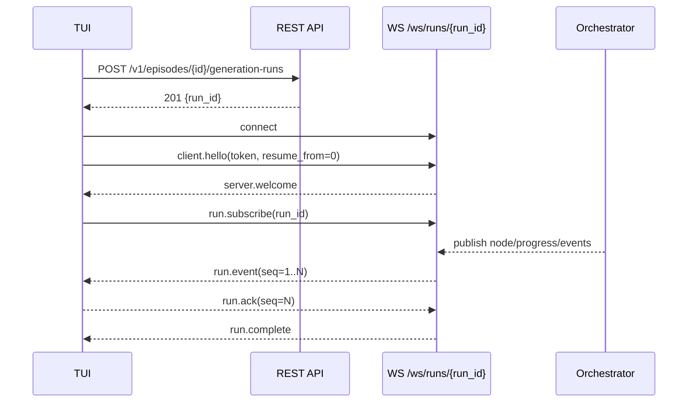
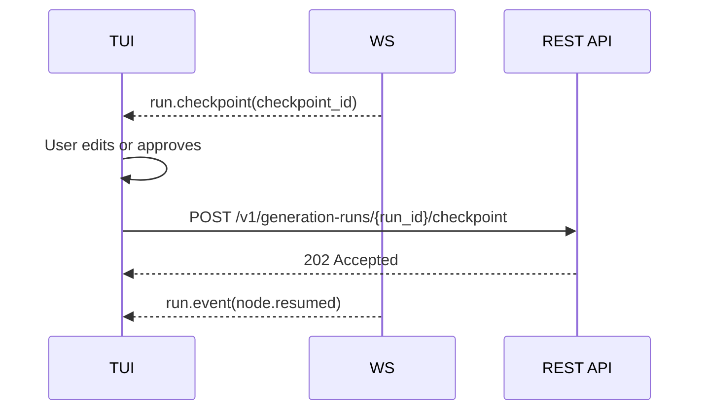
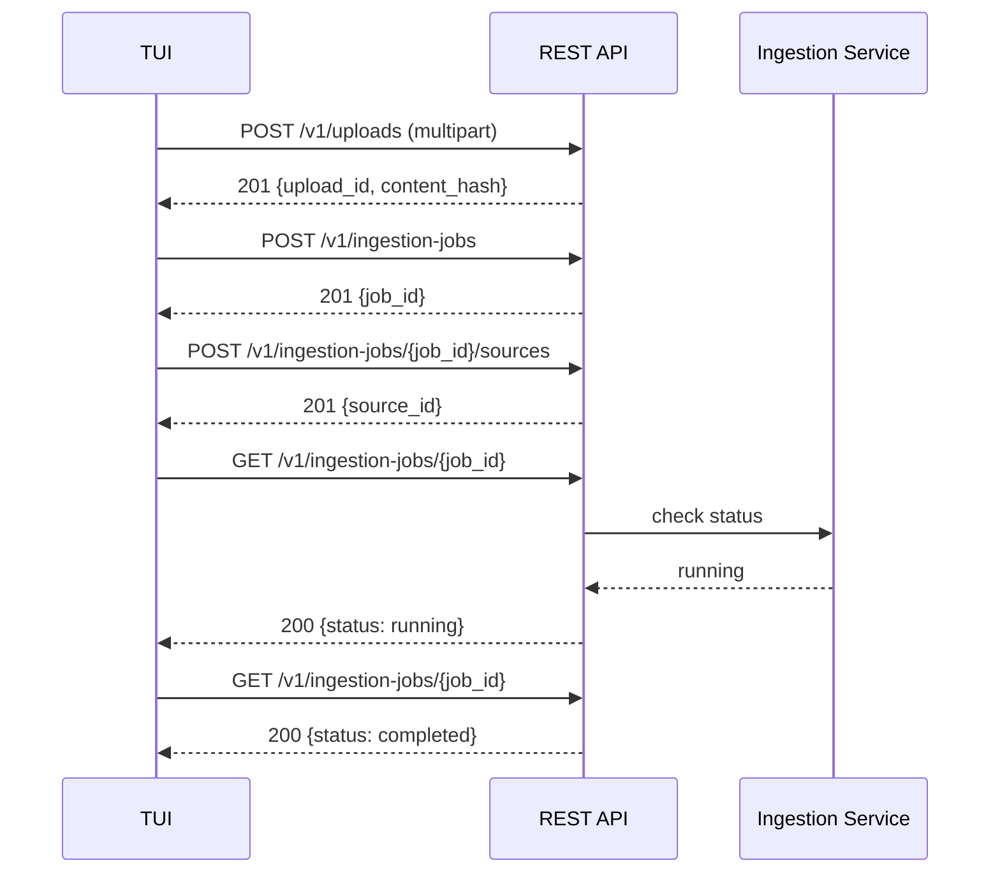
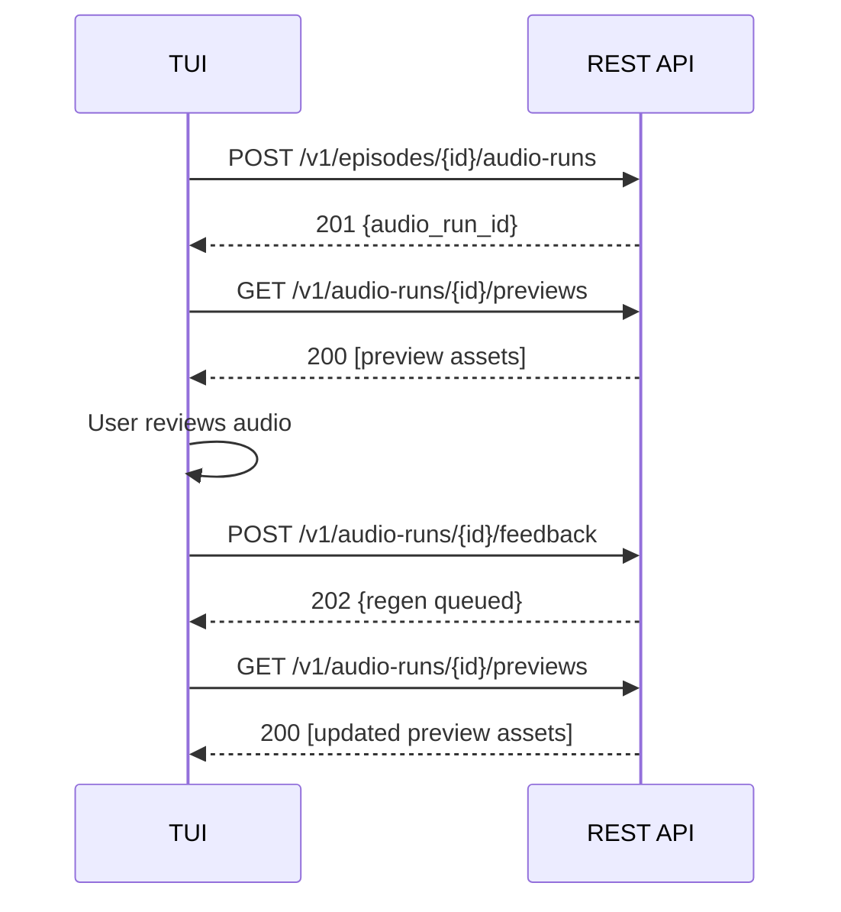

# Episodic TUI API design

This document specifies the REST and WebSocket API contract required to support
a terminal user interface (TUI) for the Episodic podcast generation platform.
It covers new endpoints, message schemas, and integration patterns while
preserving hexagonal architecture boundaries and building on the existing
canonical API surface.

The TUI itself is implemented in a separate repository. This document focuses
on the server-side API that the TUI consumes, including abstract TUI
requirements as motivation and context for the design decisions.

## Motivation

Episodic positions canonical TEI P5 as the auditable source of truth for series
and episode content, with ingestion provenance captured in TEI headers and
workflow state represented as explicit lifecycle enums and event histories. A
TUI for this system should behave as a workflow cockpit: surfacing canonical
artefacts (profiles, templates, reference documents, TEI, drafts, stems) and
workflow runs (ingestion, generation, audio synthesis) as first-class resources
rather than hiding them behind monolithic commands.

### TUI user journeys that drive API requirements

The following user journeys inform the endpoints and message schemas specified
in this document. The TUI implementation details (rendering, navigation, key
bindings) are out of scope, but the workflows determine what the API must
expose.

- **Series and template management** — create, edit, list, and inspect
  series profiles and episode templates with optimistic concurrency and change
  history.
- **Host and guest management** — manage reference documents of kind
  `host_profile` and `guest_profile` with revision workflows and series-aligned
  access.
- **Source upload and ingestion** — upload source files, create ingestion
  jobs, and monitor normalisation and conflict-resolution progress.
- **Episode prompting and generation** — configure generation runs with
  template bindings and prompt overrides, then launch and observe agentic
  generation in real time.
- **Script review and editing** — fetch, edit, and patch structured
  script projections derived from canonical TEI without forcing direct XML
  manipulation.
- **Audio review and stem management** — trigger audio synthesis runs,
  review previews, submit segment feedback, manage stems, and request partial
  regeneration.
- **Voice prompting** — test voice personas and pronunciation with short
  preview synthesis, separate from episode renders.
- **Render and export** — produce final mastered audio or stems-plus-TEI
  bundles as downloadable export jobs.
- **Realtime agentic generation view** — subscribe to live run events
  over WebSocket, observe graph node progress, and submit human-in-the-loop
  checkpoint responses.

## Design principles

1. **Resource-first modelling.** Represent distinct things (series
   profiles, reference documents, episodes, runs, assets) as resources with
   stable UUIDv7 identifiers.
2. **Hexagonal architecture enforcement.** The API layer is an inbound
   adapter. It depends on domain services and ports but never on outbound
   adapter implementations. New endpoints follow the same patterns as the
   existing canonical API surface[^1].
3. **Optimistic concurrency.** Continue the existing `expected_revision`
   and `expected_lock_version` patterns for update operations. Extend these
   patterns consistently to script versions and audio asset versions.
4. **Idempotency for side-effecting operations.** Introduce an
   `Idempotency-Key` request header for run triggers, uploads, and export jobs.
   This aligns with the system design emphasis on idempotency in orchestration.
5. **Pagination consistency.** Use `{items, limit, offset}` for list
   endpoints, consistent with the existing implementation where
   `1 <= limit <= 100` and `offset >= 0`.
6. **Separation of concerns.** Keep voice preview synthesis separate
   from episode audio runs. Keep export job creation separate from download
   byte serving.
7. **Contract-first development.** Define the API contract before
   implementing endpoints. Use OpenAPI for REST and AsyncAPI for WebSocket
   documentation.

## Existing canonical endpoints

The following endpoints are already implemented and remain unchanged[^2]:

- `POST /series-profiles`, `GET /series-profiles`
- `GET /series-profiles/{profile_id}`,
  `PATCH /series-profiles/{profile_id}`
- `GET /series-profiles/{profile_id}/history`
- `GET /series-profiles/{profile_id}/brief`
- `POST /episode-templates`, `GET /episode-templates`
- `GET /episode-templates/{template_id}`,
  `PATCH /episode-templates/{template_id}`
- `GET /episode-templates/{template_id}/history`
- `POST /series-profiles/{profile_id}/reference-documents`,
  `GET .../reference-documents`
- `GET .../reference-documents/{document_id}`,
  `PATCH .../reference-documents/{document_id}`
- `POST .../reference-documents/{document_id}/revisions`,
  `GET .../revisions`
- `GET /reference-document-revisions/{revision_id}`
- `POST /reference-bindings`, `GET /reference-bindings`,
  `GET /reference-bindings/{binding_id}`

## Proposed REST endpoints

All new endpoints use a `/v1` prefix. Existing routes remain available without
a prefix during the transition period. The version prefix is introduced to
support future contract evolution without breaking existing clients.

### Episodes and TEI

Episodes are canonical TEI-backed entities with lifecycle and approval state.

```plaintext
GET    /v1/episodes
       Query: series_profile_id, status, approval_state, limit, offset
POST   /v1/episodes

GET    /v1/episodes/{episode_id}
PATCH  /v1/episodes/{episode_id}
       Body: title, configuration; requires expected_revision

GET    /v1/episodes/{episode_id}/tei
       Returns canonical TEI XML in a JSON envelope
PUT    /v1/episodes/{episode_id}/tei
       Body: tei_xml, expected_version

GET    /v1/episodes/{episode_id}/approval-events
       Query: limit, offset
POST   /v1/episodes/{episode_id}/approval-events
       Body: action (submit | approve | reject), note, actor
```

#### TEI fetch response envelope

```json
{
  "episode_id": "018f0c2a-....",
  "tei_header_id": "018f0c2a-....",
  "tei_xml": "<?xml version=\"1.0\" encoding=\"UTF-8\"?> ...",
  "content_hash": "sha256:...",
  "version": 7,
  "updated_at": "2026-03-16T12:34:56Z"
}
```

### Ingestion jobs and sources

Ingestion jobs orchestrate multi-source normalisation into canonical TEI. The
TUI needs endpoints to create jobs, attach sources, and observe progress.

```plaintext
POST   /v1/ingestion-jobs
       Body: series_profile_id, target_episode_id (optional)
GET    /v1/ingestion-jobs
       Query: series_profile_id, status, limit, offset

GET    /v1/ingestion-jobs/{job_id}

POST   /v1/ingestion-jobs/{job_id}/sources
       Body: upload_id or source_uri, source_type, weight, metadata
GET    /v1/ingestion-jobs/{job_id}/sources
       Query: limit, offset
```

### Uploads

Binary file uploads are decoupled from ingestion to support both direct
multipart and pre-signed object storage strategies.

```plaintext
POST   /v1/uploads
       Content-Type: multipart/form-data
       Returns: upload_id, content_hash, size_bytes

POST   /v1/uploads/init
       Body: filename, content_type, size_bytes
       Returns: upload_id, put_url, headers
       (Pre-signed upload for direct-to-storage flow)
```

### Generation runs

Each generation run is a first-class resource with an append-only event log and
checkpoint support for human-in-the-loop intervention.

```plaintext
POST   /v1/episodes/{episode_id}/generation-runs
       Body: template_id, prompt_overrides, budget_hints
       Header: Idempotency-Key
GET    /v1/episodes/{episode_id}/generation-runs
       Query: status, limit, offset

GET    /v1/generation-runs/{run_id}
       Returns: run status snapshot (state, current_node, timestamps,
       budget_snapshot)

GET    /v1/generation-runs/{run_id}/events
       Query: limit, offset, after_seq
       Paginated event log (REST fallback for WebSocket)

POST   /v1/generation-runs/{run_id}/checkpoint
       Body: checkpoint_id, action (approve | request_changes | edit),
       payload (notes, patch)
```

### Script projection and editing

Script projections provide a structured JSON view of canonical TEI content.
This allows TUI editing without forcing direct XML manipulation.

```plaintext
GET    /v1/episodes/{episode_id}/script
       Returns: structured script JSON (speaker turns, segments,
       version)

PATCH  /v1/episodes/{episode_id}/script
       Body: patch operations, expected_version
       Internally translates projection patches back to canonical TEI
```

#### Script projection response

```json
{
  "episode_id": "018f0c2a-....",
  "version": 3,
  "segments": [
    {
      "id": "seg-001",
      "speaker": "host",
      "type": "narration",
      "text": "Welcome to the show...",
      "start_marker": "00:00:00",
      "notes": ""
    }
  ],
  "updated_at": "2026-03-16T12:34:56Z"
}
```

### Audio runs, previews, stems, and feedback

Audio synthesis runs are iterative, supporting preview-feedback- regeneration
cycles and partial segment regeneration.

```plaintext
POST   /v1/episodes/{episode_id}/audio-runs
       Body: voice_personas, music_beds, target_loudness_lufs
       Header: Idempotency-Key
GET    /v1/episodes/{episode_id}/audio-runs
       Query: status, limit, offset

GET    /v1/audio-runs/{audio_run_id}

GET    /v1/audio-runs/{audio_run_id}/previews
       Returns: list of preview assets (signed URLs, metadata,
       segment_id)

POST   /v1/audio-runs/{audio_run_id}/feedback
       Body: segment_id (optional for full), notes,
       action (approve | reject | regen_segment)

GET    /v1/episodes/{episode_id}/stems
       Returns: list of stem assets (narration, music, sfx)
POST   /v1/episodes/{episode_id}/stems
       Body: upload_id or stem_uri, stem_type, metadata
       (Upload replacement stem)
```

### Voice previews

Voice preview synthesis is separate from episode audio runs. It supports rapid
iteration on voice persona and pronunciation configuration.

```plaintext
POST   /v1/voice-previews
       Body: text, voice_persona_config, series_profile_id (optional)
       Header: Idempotency-Key
       Returns: preview_id

GET    /v1/voice-previews/{preview_id}
       Returns: status, audio_url (signed), duration_ms,
       voice_persona_config
```

### Export jobs

Export jobs produce final deliverables: mastered audio files or stems-plus-TEI
bundles.

```plaintext
POST   /v1/episodes/{episode_id}/exports
       Body: export_type (master_audio | stems_bundle | tei_bundle
             | stems_tei_bundle),
       format_options
       Header: Idempotency-Key
GET    /v1/episodes/{episode_id}/exports
       Query: status, limit, offset

GET    /v1/exports/{export_id}
       Returns: status, download_urls, manifest_hash,
       included_artefacts
```

## Authentication

### REST authentication

All REST endpoints require a bearer token presented in the `Authorization`
header:

```plaintext
Authorization: Bearer <token>
```

Tokens are acquired via an OAuth2 device flow or personal access token (PAT)
mechanism suited to TUI usage. Token scoping follows the role-based access
control (RBAC) and tenancy isolation model described in the system design.

### WebSocket authentication

WebSocket connections authenticate via an initial `client.hello` message
carrying a bearer token. This avoids exposing tokens in query strings. The
server must receive a valid `client.hello` within a configurable timeout
(default: 5 seconds) after accepting the connection; otherwise it closes the
connection with close code `4001` (authentication timeout).

## Error contract

All error responses follow a consistent JSON structure with a machine-readable
`code` and optional `details`:

```json
{
  "code": "validation_error",
  "message": "The 'title' field is required.",
  "details": {
    "field": "title",
    "constraint": "required"
  }
}
```

### Standard error codes

| HTTP status | Code                   | Description                                                               |
| ----------- | ---------------------- | ------------------------------------------------------------------------- |
| 400         | `validation_error`     | Request payload fails validation                                          |
| 401         | `unauthorized`         | Missing or invalid bearer token                                           |
| 403         | `forbidden`            | Token lacks required scope or role                                        |
| 404         | `not_found`            | Resource does not exist                                                   |
| 409         | `revision_conflict`    | Optimistic lock mismatch (`expected_revision` or `expected_lock_version`) |
| 409         | `idempotency_conflict` | Idempotency key reused with different payload                             |
| 422         | `unprocessable_entity` | Semantically invalid request                                              |
| 429         | `rate_limited`         | Rate limit exceeded; include `Retry-After` header                         |

## Pagination contract

List endpoints accept `limit` and `offset` query parameters and return a
consistent envelope:

```json
{
  "items": [],
  "limit": 20,
  "offset": 0,
  "total": 142
}
```

Constraints: `1 <= limit <= 100`, `offset >= 0`. Invalid values return
`400 validation_error`.

## Rate limiting

REST endpoints enforce a token-bucket rate limit per authenticated user or
organisation (proposed baseline: 60 requests per minute). Exceeding the limit
returns `429` with a `Retry-After` header.

WebSocket connections cap subscriptions per connection and event throughput per
run subscription.

## WebSocket API for realtime generation events

### Route structure

The WebSocket endpoint is mounted at:

```plaintext
/ws/runs/{run_id}
```

This route is served by a Falcon-Pachinko `WebSocketRouter` with per-connection
`WebSocketResource` instances. Room-based broadcast keyed by `run_id` enables
multiple TUI clients to observe the same run.

The `run_id` namespace initially covers generation runs only. Audio runs use a
separate event model (preview-feedback-regeneration cycles) that does not
require realtime token streaming, so audio run status is polled via REST. If
future audio synthesis workflows produce high-frequency events that benefit
from streaming, the same WebSocket route and message schema can be extended by
accepting audio run identifiers; at that point a `run_kind` field (`generation`
or `audio`) should be added to `run.subscribe` and `run.event` messages to
disambiguate. Until then, clients should treat `/ws/runs/{run_id}` as accepting
generation run identifiers exclusively.

### Message envelope

All messages use a `type` tag field for schema-driven dispatch via `msgspec`
tagged unions. Messages are serialized as JSON.

### Client-to-server messages

#### `client.hello`

Sent immediately after connection. Authenticates the client and optionally
requests event replay from a sequence number.

```json
{
  "type": "client.hello",
  "token": "...",
  "client_id": "episodic-tui",
  "resume_from": 0
}
```

#### `run.subscribe`

Subscribes to events for a specific run. The `run_id` must match the route
parameter.

```json
{
  "type": "run.subscribe",
  "run_id": "018f...."
}
```

#### `run.ack`

Acknowledges receipt of events up to a sequence number. Used for backpressure
control and reconnection semantics.

```json
{
  "type": "run.ack",
  "run_id": "018f....",
  "seq": 1850
}
```

#### `checkpoint.submit`

Submits a human-in-the-loop response to a checkpoint prompt.

```json
{
  "type": "checkpoint.submit",
  "run_id": "018f....",
  "checkpoint_id": "018f....",
  "action": "approve",
  "payload": {
    "notes": "Approved with minor edits.",
    "patch": []
  }
}
```

### Server-to-client messages

#### `server.welcome`

Sent after successful `client.hello` authentication.

```json
{
  "type": "server.welcome",
  "connection_id": "c-123",
  "heartbeat_sec": 15
}
```

#### `run.event`

Streamed event from the generation or audio run. Each event carries a
monotonically increasing `seq` number for ordering and replay.

```json
{
  "type": "run.event",
  "run_id": "018f....",
  "seq": 1843,
  "ts": "2026-03-16T12:34:56Z",
  "event": {
    "kind": "node.started",
    "node": "Generate",
    "meta": {}
  }
}
```

#### `run.checkpoint`

Indicates that the run requires human input before proceeding.

```json
{
  "type": "run.checkpoint",
  "run_id": "018f....",
  "checkpoint_id": "018f....",
  "prompt": "Editor approval required",
  "options": ["approve", "request_changes"]
}
```

#### `run.complete`

Terminal message indicating the run has finished.

```json
{
  "type": "run.complete",
  "run_id": "018f....",
  "status": "succeeded",
  "summary": {}
}
```

#### `server.error`

Error notification from the server.

```json
{
  "type": "server.error",
  "code": "unauthorized",
  "details": {}
}
```

### Event kinds

The `run.event` message carries an `event.kind` field. The following event
kinds are defined:

| Kind                 | Description                                                |
| -------------------- | ---------------------------------------------------------- |
| `node.started`       | Graph node execution has begun                             |
| `node.progress`      | Progress update within a node (percentage, partial output) |
| `node.completed`     | Graph node execution has finished                          |
| `token.delta`        | Incremental token output (optional, can be high frequency) |
| `qa.result`          | Evaluator scores and remediation hints                     |
| `budget.warning`     | Budget threshold approached                                |
| `budget.exceeded`    | Budget cap reached; run may be paused                      |
| `checkpoint.created` | Human input required                                       |
| `artefact.updated`   | Draft script, show notes, or chapters updated              |
| `log`                | Structured log record suitable for UI display              |

### Backpressure

Three mechanisms control backpressure, applied in escalating order:

1. **Inbound queue limit.** Falcon's `ws_options.max_receive_queue` is
   set to a small value to prevent client message spam.
2. **Event compaction.** When the gap between the most recent event
   `seq` and the last acknowledged `seq` exceeds a configurable soft threshold
   (for example, 500 events), the server begins compacting high-frequency
   events (`token.delta`, `node.progress`) into periodic aggregates before
   sending them. The server does not notify the client when compaction
   activates; compacted events are indistinguishable from normal events apart
   from coarser granularity.
3. **Acknowledgement-gated disconnect.** The server maintains a bounded
   ring buffer per run subscription (for example, the last 2000 events). If the
   acknowledgement lag exceeds a hard threshold (for example, 1500 events)
   despite compaction, the server executes the following sequence:
   1. Sends `server.error` with `code="backpressure"` containing the
      current buffer head `seq` and the last acknowledged `seq`.
   2. Closes the connection with close code `4000`.
   3. The client must reconnect and use `resume_from` in `client.hello`
      to replay from its last acknowledged position, or fall back to
      the REST event log if the buffer has been exhausted.

### Reconnection

On reconnect, the client sends `client.hello` with the `resume_from` field set
to the last acknowledged sequence number. The server replays buffered events
from that point if they are still retained.

If the requested sequence is no longer in the buffer, the server sends
`server.error` with `code="resume_unavailable"` and the client falls back to
the REST endpoint `GET /v1/generation-runs/{run_id}/events` to catch up before
re-subscribing.

### WebSocket close codes

| Close code | Meaning                                                           |
| ---------- | ----------------------------------------------------------------- |
| 1000       | Normal closure                                                    |
| 1008       | Policy violation (invalid token in `client.hello`)                |
| 1011       | Internal server error                                             |
| 4000       | Backpressure exceeded; client must reconnect                      |
| 4001       | Authentication timeout; valid `client.hello` not received in time |

## Sequence diagrams

### Start run then watch events

For screen readers: the following sequence diagram shows a TUI client starting
a generation run via REST, then subscribing to live events via WebSocket.



_Figure 1: Generation run lifecycle from launch through WebSocket event
streaming._

### Checkpoint intervention

For screen readers: the following sequence diagram shows how a TUI client
responds to a human-in-the-loop checkpoint during a generation run.



_Figure 2: Human-in-the-loop checkpoint intervention during a generation run._

### Ingestion job lifecycle

For screen readers: the following sequence diagram shows a TUI client uploading
a source file, creating an ingestion job, and monitoring progress.



_Figure 3: Source upload and ingestion job lifecycle._

### Audio review and feedback

For screen readers: the following sequence diagram shows a TUI client
requesting audio previews, submitting feedback, and triggering partial
regeneration.



_Figure 4: Audio preview review and feedback-driven regeneration cycle._

## Hexagonal architecture alignment

The API design adheres to the enforced hexagonal architecture boundaries
described in the system design document.

### Port ownership

New domain concepts introduced by this API (generation runs, audio runs, script
projections, export jobs, voice previews) require corresponding port
definitions owned by the domain layer:

- `GenerationRunPort` — persistence and lifecycle for generation runs,
  events, and checkpoints.
- `AudioRunPort` — persistence and lifecycle for audio synthesis runs,
  previews, and feedback.
- `ScriptProjectionPort` — read and patch structured script
  projections with version tracking.
- `ExportJobPort` — persistence and lifecycle for export jobs.
- `VoicePreviewPort` — creation and status tracking for voice preview
  synthesis requests.
- `UploadPort` — file upload handling (direct multipart or pre-signed
  URL generation).
- `RunEventBusPort` — publish and subscribe semantics for streaming
  run events to WebSocket connections.

### Adapter boundaries

| Layer                               | Responsibility                                                                                     |
| ----------------------------------- | -------------------------------------------------------------------------------------------------- |
| Inbound adapters (Falcon resources) | Parse HTTP/WebSocket requests, validate payloads, delegate to domain services, serialize responses |
| Domain services                     | Orchestrate business logic using port interfaces only                                              |
| Outbound adapters                   | Implement port interfaces for Postgres, object storage, message broker, and LLM/TTS vendors        |

### Forbidden dependencies

- Inbound adapters must not import outbound adapter modules.
- Outbound adapters must not import inbound adapter modules.
- Domain services must not import Falcon, SQLAlchemy, or vendor SDK
  modules.
- WebSocket resources (Falcon-Pachinko) must interact with the run
  event bus through `RunEventBusPort`, not by directly accessing the
  orchestration engine.

## Data model extensions

### New domain entities

The following entities extend the canonical domain model to support the TUI
workflows. Each entity follows the existing frozen-dataclass pattern with
UUIDv7 identifiers and timestamp fields.

#### GenerationRun

```plaintext
id: UUID
episode_id: UUID
template_id: UUID
status: GenerationRunStatus (pending | running | paused |
        succeeded | failed | cancelled)
current_node: str | None
started_at: datetime | None
ended_at: datetime | None
budget_snapshot: JsonMapping
configuration: JsonMapping
created_at: datetime
updated_at: datetime
```

#### GenerationEvent (append-only)

```plaintext
id: UUID
generation_run_id: UUID
seq: int
kind: str
payload: JsonMapping
created_at: datetime
```

#### Checkpoint

```plaintext
id: UUID
generation_run_id: UUID
prompt: str
options: list[str]
response_action: str | None
response_payload: JsonMapping | None
responded_at: datetime | None
created_at: datetime
```

#### AudioRun

```plaintext
id: UUID
episode_id: UUID
status: AudioRunStatus (pending | running | succeeded |
        failed | cancelled)
voice_personas: JsonMapping
music_beds: JsonMapping
target_loudness_lufs: float
started_at: datetime | None
ended_at: datetime | None
created_at: datetime
updated_at: datetime
```

#### PreviewAsset

```plaintext
id: UUID
audio_run_id: UUID
segment_id: str | None
storage_uri: str
content_hash: str
duration_ms: int
format: str
created_at: datetime
```

#### StemAsset

```plaintext
id: UUID
episode_id: UUID
stem_type: str (narration | music | sfx | ambience)
storage_uri: str
content_hash: str
duration_ms: int
format: str
metadata: JsonMapping
created_at: datetime
```

#### AudioFeedback

```plaintext
id: UUID
audio_run_id: UUID
segment_id: str | None
action: str (approve | reject | regen_segment)
notes: str | None
actor: str | None
created_at: datetime
```

#### ExportJob

```plaintext
id: UUID
episode_id: UUID
export_type: str (master_audio | stems_bundle | tei_bundle
             | stems_tei_bundle)
status: ExportStatus (pending | running | succeeded | failed)
format_options: JsonMapping
download_urls: list[str]
manifest_hash: str | None
started_at: datetime | None
ended_at: datetime | None
created_at: datetime
updated_at: datetime
```

#### VoicePreview

```plaintext
id: UUID
series_profile_id: UUID | None
text: str
voice_persona_config: JsonMapping
status: str (pending | succeeded | failed)
audio_url: str | None
duration_ms: int | None
created_at: datetime
```

### Storage considerations

- **Postgres** stores metadata, workflow state, event logs,
  checkpoints, and feedback records.
- **Object storage** (S3-compatible) stores source blobs, preview
  audio, mastered audio, stems, and export bundles.
- **TEI payloads** continue to use zstd compression in persistence,
  with the API returning plain XML.
- **Event logs** are append-only and partitioned by `generation_run_id`
  for efficient range queries.
- **Loudness targets** are stored per audio run as
  `target_loudness_lufs` (default: -16 LUFS for podcast distribution, -23 LUFS
  for broadcast contexts per EBU R128).

## Security considerations

- **Least-privilege tokens.** Scope tokens to series or organisation
  level; enforce RBAC consistently across REST and WebSocket surfaces.
- **Audit trails.** Preserve approval events, run events, and user
  edits as immutable history.
- **Upload hardening.** Enforce content-type allowlists, maximum file
  size limits, and store content hashes for integrity verification.
- **WebSocket abuse controls.** Authenticate before processing
  messages, rate-limit subscribe and unsubscribe operations, bound buffer
  sizes, and enforce inactivity timeouts.
- **Close codes.** Use RFC 6455 defined semantics and reserve
  application-specific close codes in the 4000-4999 range.

## Testing strategy

### REST endpoints

- Unit tests for each Falcon resource covering request validation,
  serialization, and error mapping.
- Integration tests using `ASGIConductor` against a real database to
  verify end-to-end behaviour.
- Behavioural tests (pytest-bdd) for key user journeys: ingestion
  lifecycle, generation run with checkpoint, audio feedback cycle, and export
  job completion.
- Contract tests verifying pagination, optimistic locking, and error
  response consistency.

### WebSocket endpoints

- Unit tests for message schema validation and dispatch using
  Falcon-Pachinko test utilities.
- Integration tests for connection lifecycle: authentication, event
  streaming, acknowledgement, and reconnection.
- Behavioural tests for checkpoint intervention flow.

### Hexagonal boundary tests

- Architecture tests verifying that new inbound adapters do not import
  outbound adapter modules.
- Port contract tests exercising each new port against its adapter
  implementation.

______________________________________________________________________

[^1]: Existing endpoints are documented in the developers' guide
    and the 2.2.7 execution plan.

[^2]: Route definitions are in `episodic/api/app.py`.
