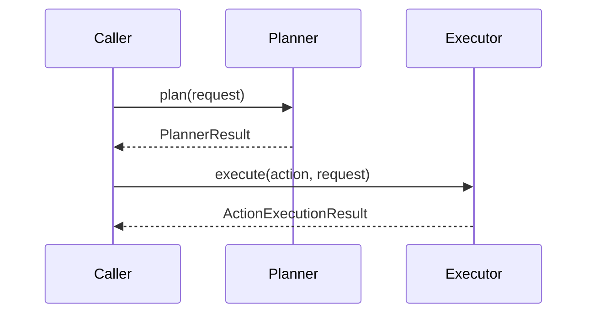

# Implement structured-output planning and tool-calling execution

This ExecPlan (execution plan) is a living document. The sections
`Constraints`, `Tolerances`, `Risks`, `Progress`, `Surprises & Discoveries`,
`Decision Log`, and `Outcomes & Retrospective` must be kept up to date as work
proceeds.

Status: COMPLETE

## Purpose and big picture

Roadmap item 2.4.1 asks the platform to make one generation run smart enough to
plan its own work with structured output, then execute enrichment steps through
controlled tool-calling patterns. After this change, the Content Generation
Orchestrator should be able to take canonical episode inputs, produce a typed
execution plan, choose an appropriate model tier for each stage, invoke
enrichment tools through ports rather than ad hoc imports, and return a typed
execution result that later roadmap items can wrap with checkpointing, queue
routing, and cost ledger persistence.

This plan deliberately limits scope to the first vertical slice of that
behaviour. The implementation should create the planning and execution seam,
prove model tiering decisions, and establish reusable tool-calling patterns for
enrichment work. It should not yet implement suspend-and-resume checkpointing
(`2.4.2`), Celery queue routing (`2.4.3`), hierarchical cost ledger storage
(`2.4.4`), or pricing and budget ports from `2.5.x`.

Success is observable in eight ways:

1. A new orchestration service accepts canonical generation inputs and returns
   a typed plan containing ordered steps, selected model tiers, and tool
   intents derived from one structured-output planning call.
2. The planner uses the existing `LLMPort` boundary and validates the model
   response as strict JSON before execution continues.
3. The executor resolves enrichment actions through explicit ports or
   protocols, not by letting LangGraph nodes import concrete adapters or call
   sibling adapters directly.
4. The first shipped tool-calling pattern covers at least the already-built
   show-notes enrichment path in `episodic/generation/show_notes.py`, with a
   design that can absorb chapter markers, guest bios, and sponsor reads later
   without changing the planner contract.
5. Model tiering is explicit and testable: planning uses a higher-capability
   model tier, whilst execution and enrichment use cheaper model identifiers
   when configured to do so.
6. Unit tests (`pytest`) prove structured-response parsing, tier selection,
   execution routing, tool error handling, and boundary enforcement at the
   application-service layer.
7. Behavioural tests (`pytest-bdd`) using Vidai Mock prove that one orchestral
   generation request produces a deterministic planning call plus downstream
   execution activity through the defined tool-calling path.
8. The required validation commands pass sequentially:
   `make check-fmt`, `make typecheck`, `make lint`, `make test`,
   `PATH=/root/.bun/bin:$PATH make markdownlint`, and `make nixie`.

Because this is an ExecPlan draft, implementation must not begin until the user
explicitly approves this plan or requests revisions.

## Constraints

- Preserve hexagonal architecture boundaries. Domain and application code may
  depend on ports, typed data transfer objects (DTOs), and orchestration
  helpers, but must not import Falcon runtime code, SQLAlchemy adapters,
  concrete OpenAI clients, or Celery worker implementations directly.
- Keep LangGraph as an internal orchestration mechanism rather than a new
  integration boundary. Graph nodes must depend on ports only, matching the
  rules in
  `docs/episodic-podcast-generation-system-design.md#langgraph-integration-principles`.
- Keep all model interactions behind `episodic.llm.LLMPort`. The planner and
  any LLM-backed enrichment execution path must use
  `LLMPort.generate(LLMRequest) -> LLMResponse`.
- Treat structured output as an internal planning contract, not as a new
  canonical content schema. Canonical content remains Text Encoding Initiative
  (TEI) based; JSON is allowed only as a typed projection used for planning.
- Use explicit tool interfaces for enrichment steps. The execution layer may
  call application services such as show-notes generation, but must do so
  through protocols or ports that keep adapters isolated from each other.
- Limit the first implementation to in-process orchestration. Checkpoint
  persistence, task resumption, queue routing, cost-ledger storage, pricing
  snapshots, metering, and budget reservation remain later roadmap items.
- Follow the repository's test-first workflow for new functionality: write or
  modify unit and behavioural tests first, confirm failure, implement the
  change, and rerun the tests.
- Use Vidai Mock for behavioural testing of inference services. Do not replace
  it with live provider calls.
- Update the design document, the user's guide, and the developer's guide to
  describe the shipped behaviour and maintainer workflow. Record durable
  architectural decisions in a new Architecture Decision Record (ADR).
- Do not mark `docs/roadmap.md` item `2.4.1` done until the feature is
  implemented, documented, tested, and all validation gates pass.

## Tolerances (exception triggers)

- Scope tolerance: stop and escalate if a working vertical slice for `2.4.1`
  appears to require changes to more than 18 files or 1200 net new lines before
  tests pass.
- Interface tolerance: stop and escalate if implementation requires changing
  the public signatures of `LLMPort`, `LLMRequest`, `LLMResponse`,
  `ShowNotesGenerator.generate(...)`, or the already-shipped Pedante public
  DTOs.
- Dependency tolerance: stop and escalate if a new runtime dependency is
  required beyond what is already declared in `pyproject.toml`.
- Boundary tolerance: stop and escalate if the only practical implementation
  path requires LangGraph nodes to import concrete adapters or requires one
  adapter to call another directly.
- Costing tolerance: stop and escalate if model tiering cannot be implemented
  without also introducing `PricingCataloguePort`, `CostLedgerPort`, or
  `BudgetPort` storage work from `2.4.4` and `2.5.x`.
- Queueing tolerance: stop and escalate if tool execution can only work by
  landing Celery routing or checkpoint persistence in the same change.
- Behaviour tolerance: stop and escalate after three failed attempts to settle
  the same Vidai Mock scenario or structured-output parsing test cluster.
- Documentation tolerance: stop and escalate if the required design decision
  cannot be captured cleanly in one ADR and instead implies a larger RFC-sized
  architecture change.

## Risks

- Risk: no general generation graph exists yet; only the Pedante evaluator has
  a minimal LangGraph seam. Severity: high. Likelihood: high. Mitigation: start
  with a narrow application service and graph wrapper dedicated to one
  generation planning-and-execution path rather than designing the entire
  future graph up front.

- Risk: model tiering can easily leak pricing concerns from `2.5.x` into this
  task. Severity: high. Likelihood: medium. Mitigation: treat tiering as a
  configuration and routing decision only for `2.4.1`; defer deterministic
  billing storage and pricing snapshots to later roadmap items while still
  leaving metadata seams ready.

- Risk: the planner may overfit to one enrichment action and become hard to
  extend to chapter markers, guest bios, and sponsor reads. Severity: medium.
  Likelihood: high. Mitigation: define a small typed action vocabulary and
  execution contract now, then wire only show notes as the first concrete tool.

- Risk: tool-calling can violate hexagonal boundaries if the graph directly
  imports show-notes implementation code or future adapters. Severity: high.
  Likelihood: medium. Mitigation: introduce a dedicated enrichment-tool port
  and keep orchestration code dependent on that port only.

- Risk: Vidai Mock scenarios may become brittle if the planner prompt embeds
  too much incidental detail. Severity: medium. Likelihood: medium. Mitigation:
  keep the behavioural fixture focused on the structured plan payload and
  observable execution result, not exact prompt wording.

- Risk: roadmap item `2.4.1` sits adjacent to checkpointing, queue routing,
  and cost metering, so an implementer may accidentally expand scope. Severity:
  medium. Likelihood: high. Mitigation: repeat the non-goals in the ADR, docs,
  and test names so the boundary stays visible throughout the change.

## Progress

- [x] (2026-04-16 00:00Z) Retrieved project-memory notes covering
  architecture, validation commands, Vidai Mock usage, and prior roadmap
  decisions.
- [x] (2026-04-16 00:10Z) Reviewed roadmap item `2.4.1`, adjacent items
  `2.4.2` through `2.5.5`, and the design sections for LangGraph integration,
  orchestration ports, inference strategy, and cost accounting.
- [x] (2026-04-16 00:20Z) Inspected current repository seams:
  `episodic/llm/ports.py`, `episodic/generation/show_notes.py`,
  `episodic/qa/langgraph.py`, `docs/users-guide.md`, and
  `docs/developers-guide.md`.
- [x] (2026-04-16 00:35Z) Drafted this ExecPlan for roadmap item `2.4.1`.
- [x] (2026-04-21 10:06Z) Stage A: added fail-first unit and behavioural tests
  for structured planning, tool-port execution, LangGraph flow, and Vidai Mock
  orchestration.
- [x] (2026-04-21 10:14Z) Stage B: implemented typed planning DTOs, strict JSON
  parsing, and configuration-driven model-tier selection in
  `episodic/orchestration/generation.py`.
- [x] (2026-04-21 10:14Z) Stage C: implemented the orchestration application
  service and LangGraph wrapper in `episodic/orchestration/`.
- [x] (2026-04-21 10:14Z) Stage D: implemented the first enrichment tool port
  and the show-notes execution path.
- [x] (2026-04-21 10:17Z) Stage E: documented the architecture decision and
  updated the design, user, and developer guides.
- [x] (2026-04-21 10:35Z) Stage F: ran the full validation sequence, updated
  roadmap item `2.4.1`, and recorded final outcomes in this plan.

## Surprises & Discoveries

- Observation: `LLMPort`, `ShowNotesGenerator`, and the Pedante LangGraph seam
  already provide the exact three reference implementations needed for this
  slice: provider-neutral LLM invocation, strict JSON parsing, and compact
  typed graph state. Evidence: `episodic/llm/ports.py`,
  `episodic/generation/show_notes.py`, and `episodic/qa/langgraph.py`
  inspection on 2026-04-21. Impact: the orchestration feature can stay small
  and follow existing local patterns instead of introducing a new abstraction
  style.

- Observation: targeted orchestration tests require
  `PYO3_USE_ABI3_FORWARD_COMPATIBILITY=1` when run through `uv` on Python 3.14
  because `tei-rapporteur` still builds via PyO3 0.23.x. Evidence:
  `/tmp/2-4-1-stage-a-pytest.log` and the failing build trace on 2026-04-21.
  Impact: use that environment flag consistently for targeted test runs and
  full validation commands until the dependency updates.

- Observation: the first focused test slice passed after implementation with
  15 orchestration-specific tests covering planner parsing, tool-port
  execution, LangGraph state flow, and the live Vidai Mock behaviour scenario.
  Evidence: `PYO3_USE_ABI3_FORWARD_COMPATIBILITY=1 uv run pytest`
  `tests/test_generation_orchestration.py`
  `tests/test_generation_orchestration_langgraph.py`
  `tests/steps/test_generation_orchestration_steps.py` on 2026-04-21. Impact:
  the vertical slice is stable enough to proceed to documentation and full
  repository gates.

- Observation: full validation passed after one implementation fix for ordered
  async tool execution. Evidence: `make fmt`, `make check-fmt`,
  `make typecheck`, `make lint`, `make test`,
  `PATH=/root/.bun/bin:$PATH make markdownlint`, and `make nixie` all succeeded
  on 2026-04-21, with `make test` reporting 367 passed and 2 skipped. Impact:
  roadmap item `2.4.1` can be marked complete without caveats.

- Observation: the repository already has `langgraph` and `granian` declared in
  `pyproject.toml`, so `2.4.1` can build on an installed orchestration
  dependency without a new package addition. Evidence: `pyproject.toml`
  inspection on 2026-04-16. Impact: the first implementation should stay within
  current dependencies.

- Observation: the only current LangGraph code is the minimal Pedante seam in
  `episodic/qa/langgraph.py`. There is no general content-generation graph, no
  checkpoint adapter, and no queue resume path yet. Evidence: repository
  inspection on 2026-04-16. Impact: `2.4.1` must establish a new orchestration
  seam but should stay narrow.

- Observation: `episodic/generation/show_notes.py` already provides the first
  concrete enrichment service and already uses `LLMPort`. Evidence: repository
  inspection on 2026-04-16. Impact: show notes are the safest first tool to
  wire into a tool-calling execution path.

- Observation: the design document already separates planning from execution
  conceptually, stating that planning uses structured output and execution uses
  tool calling. Evidence:
  `docs/episodic-podcast-generation-system-design.md#langgraph-integration-principles`
   on 2026-04-16. Impact: the ADR and implementation should align to that
  existing design language rather than invent new terms.

- Observation: `docs/users-guide.md` and `docs/developers-guide.md` mention
  model tiering and LangGraph workflows only at a high level. Evidence:
  documentation inspection on 2026-04-16. Impact: implementation will need
  concrete user-facing and maintainer-facing guidance for the new workflow.

- Observation: there is no `docs/contents.md` file in this repository even
  though the documentation style guide recommends one. Evidence:
  `sed -n '1,260p' docs/contents.md` failed with "No such file or directory" on
  2026-04-16. Impact: this plan does not add a new contents file because that
  is broader documentation-systems work, not part of roadmap item `2.4.1`.

## Decision Log

- Decision: keep `2.4.1` narrowly scoped to structured planning, model tier
  selection, and in-process tool execution. Rationale: the roadmap already
  splits checkpointing, queue routing, cost ledger storage, pricing, and budget
  enforcement into later items, so collapsing them into this change would make
  progress harder to validate. Date/Author: 2026-04-16 / Codex.

- Decision: use show-notes generation as the first concrete enrichment tool.
  Rationale: it already exists, already respects `LLMPort`, and exercises the
  enrichment pattern without dragging in unbuilt chapter-marker or sponsor-read
  services. Date/Author: 2026-04-16 / Codex.

- Decision: represent the planner result as a typed action plan with explicit
  action kinds and model-tier assignments, not as free-form prose or raw model
  JSON passed deeper into the graph. Rationale: strict typed plans are easier
  to test, easier to route through LangGraph, and align with the design
  document's structured-output strategy. Date/Author: 2026-04-16 / Codex.

- Decision: introduce tool execution through an application-level port rather
  than letting LangGraph call existing enrichment services directly. Rationale:
  this preserves the hexagonal dependency rule and keeps future
  queue-dispatched execution compatible with the same contract. Date/Author:
  2026-04-16 / Codex.

- Decision: implement the first vertical slice in a dedicated
  `episodic/orchestration/` package rather than placing it under
  `episodic/generation/` or `episodic/qa/`. Rationale: the new planner and
  executor coordinate generation concerns without being specific to a single
  enrichment tool or evaluator, and the dedicated package keeps future
  checkpointing and queue-routing work adjacent without coupling them to
  show-notes or Pedante internals. Date/Author: 2026-04-21 / Codex.

- Decision: keep the first tool port deliberately narrow by exposing one
  `ToolExecutorPort.execute(...)` operation and shipping a single
  `ShowNotesToolExecutor` implementation. Rationale: this preserves the adapter
  boundary required by the roadmap while avoiding an overbuilt plugin system
  before additional enrichment tools exist. Date/Author: 2026-04-21 / Codex.

## Outcomes & Retrospective

Roadmap item `2.4.1` is now implemented.

Delivered outcome:

- The repository now has a dedicated `episodic/orchestration/` package that
  introduces a general content-generation orchestration seam beyond Pedante.
- One planning call produces a strict typed `ExecutionPlan` via
  `StructuredGenerationPlanner`.
- One execution path resolves that plan through `ToolExecutorPort`, with
  `ShowNotesToolExecutor` as the first concrete tool adapter.
- An in-process LangGraph wrapper now drives the same flow through
  `plan -> execute -> finish`.
- Vidai Mock proves the end-to-end plan-and-execute behaviour in
  `tests/features/generation_orchestration.feature`.
- Documentation, the ADR set, and `docs/roadmap.md` now reflect the shipped
  feature accurately.

Retrospective:

- The largest implementation hazard was Python's treatment of
  `tuple(await ... for ...)` as an async generator rather than a plain
  iterator. Explicit ordered loops were retained for tool execution to preserve
  sequence semantics and keep the full test suite stable.
- The existing show-notes and Pedante patterns were sufficient scaffolding for
  this milestone; no new runtime dependency or broader architecture rewrite was
  needed.

## Context and orientation

The implementing agent should start from the current repository layout and
existing seams:

- `episodic/llm/ports.py` defines the provider-neutral request, response, usage,
  and budget DTOs behind `LLMPort`.
- `episodic/generation/show_notes.py` implements the only current enrichment
  service that already uses `LLMPort`.
- `episodic/qa/langgraph.py` demonstrates the existing LangGraph style in this
  codebase: a small typed state object, a node function, and conditional
  routing.
- `tests/features/` and `tests/steps/` already contain Vidai Mock-backed
  behavioural coverage patterns for LLM-facing services.
- `docs/episodic-podcast-generation-system-design.md` is the normative design
  reference for LangGraph integration, orchestration ports, model tiering, and
  cost-accounting boundaries.

The implementation will likely add a new package such as
`episodic/orchestration/` or `episodic/generation/orchestration/`. Choose the
final location based on the narrowest feature-oriented boundary that keeps
planning and execution separate from `qa/` and `canonical/`. Record that choice
in the ADR and update this section once implementation begins.

## Proposed architecture

The first implementation should introduce three layers.

1. A typed planning layer that asks an LLM for a structured execution plan.
   This layer owns prompt construction, strict JSON decoding, model-tier
   selection rules, and planner DTO validation.
2. An application-service execution layer that interprets the typed plan and
   dispatches each action through a tool port. This layer owns action routing,
   step result aggregation, and failure handling for unsupported or malformed
   actions.
3. A small LangGraph wrapper that executes the sequence
   `initialize -> plan -> execute -> finish` using typed state and conditional
   edges where useful. For `2.4.1`, it remains in-process.



The planning layer should expose a DTO set along these lines:

```plaintext
PlanningRequest
- episode_id or generation correlation identifier
- series profile / template context
- canonical TEI script or brief projection
- enabled enrichment capabilities

ExecutionPlan
- plan_version
- selected_planning_model
- selected_execution_model
- steps: tuple[PlannedAction, ...]

PlannedAction
- action_id
- action_kind (for example `generate_show_notes`)
- rationale
- model_tier (`planning` | `execution`)
- required_inputs
```

The execution layer should expose a small port surface, for example:

```plaintext
EnrichmentToolPort
- execute(action: PlannedAction, context: ExecutionContext) -> ActionResult
```

That port may be implemented by a dispatcher that knows how to call show-notes
generation first and can later grow to handle chapter markers, guest bios, and
sponsor reads without changing the planner DTOs.

## ADR to add

Create a new ADR under `docs/adr/` before finalizing the implementation. The
working topic should be "structured planning and tool execution for generation
orchestration". The ADR should record:

1. Why planning is modelled as strict structured output instead of prose.
2. Why execution is modelled through tool ports rather than direct adapter
   imports inside LangGraph nodes.
3. How model tiering is represented at this stage without taking on full
   pricing-catalogue work.
4. Why show notes are the first shipped enrichment tool.
5. Which responsibilities are explicitly deferred to `2.4.2`, `2.4.3`,
   `2.4.4`, and `2.5.x`.

The design document should then reference the new ADR in its accepted-decision
list.

## Implementation stages

## Stage A: define failing tests first

Add tests before production code changes. The point of this stage is to freeze
the intended external behaviour of `2.4.1`.

Unit-test targets:

- A planner test that feeds a fake `LLMPort` response containing a valid JSON
  plan and asserts that the service returns typed plan DTOs with stable action
  ordering and tier assignments.
- A planner validation test that feeds malformed JSON, unknown action kinds,
  blank rationale text, or missing fields and asserts deterministic parsing
  errors.
- A tier-selection test that proves planning and execution model identifiers
  are selected from configuration rather than hardcoded in prompts.
- An executor test that feeds a valid `ExecutionPlan` containing one
  `generate_show_notes` action and asserts that the executor dispatches through
  the tool port, not through a concrete show-notes import in the test subject.
- An executor failure test that covers unsupported action kinds and tool
  exceptions.
- A LangGraph seam test that proves graph state updates after planning and
  execution remain typed and deterministic.

Behavioural-test target:

- Add a `pytest-bdd` scenario proving that one content-generation orchestration
  request uses Vidai Mock to obtain a structured plan, then executes the
  show-notes action and returns an observable execution summary.

Suggested files:

- `tests/test_generation_orchestration.py`
- `tests/test_generation_orchestration_langgraph.py`
- `tests/features/generation_orchestration.feature`
- `tests/steps/test_generation_orchestration_steps.py`

Run the new tests first and confirm they fail for the expected missing-symbol
or wrong-behaviour reasons before proceeding.

## Stage B: implement typed planning and model-tier configuration

Add the planning DTOs and service. Keep the first version small and strict.

Implementation guidance:

- Create a new orchestration module or package with planner DTOs and parser
  helpers.
- Mirror the strict parsing style already used in
  `episodic/generation/show_notes.py` and `episodic/qa/pedante.py`: explicit
  object decoding, explicit non-empty string checks, and deterministic error
  messages.
- Introduce an orchestration configuration object that includes:
  - planning model identifier
  - execution model identifier
  - provider operation for planner calls
  - token budgets for planner and executor where needed
  - enabled action kinds
- Keep model tiering configuration-focused. Do not calculate money or budgets
  in this stage. The only shipped behaviour is choosing which configured model
  identifier each stage should use.
- Ensure the planner prompt asks for JSON only and defines a minimal action
  schema.

Acceptance for Stage B:

- The planner can turn one `LLMResponse.text` value into a typed
  `ExecutionPlan`.
- Invalid planner output fails fast with deterministic parsing errors.
- Tier selection is observable through unit tests and configuration objects.

## Stage C: implement orchestration service and LangGraph wrapper

Add the application-service execution flow that uses the planner, then executes
its actions.

Implementation guidance:

- Add a service such as `GenerationOrchestrator` or
  `StructuredPlanningOrchestrator` that accepts the planning service, the tool
  port, and orchestration configuration.
- Define a typed request DTO for the orchestration entrypoint. Keep it focused
  on inputs already available in the repository today: canonical TEI, profile
  or template context, and correlation metadata.
- Define a typed result DTO that contains:
  - the parsed plan
  - action results
  - selected models or tiers
  - normalized `LLMUsage` from the planner call and any LLM-backed tools when
    available
- Aggregate usage metadata for observability, but do not persist ledger
  entries yet.
- Add a LangGraph wrapper modelled on `episodic/qa/langgraph.py`. Keep the
  state object typed and compact. The first version may terminate after one
  execution pass without retries.

Acceptance for Stage C:

- A caller can invoke one application service and get a typed orchestration
  result.
- A small LangGraph graph can drive the same flow in-process.
- The LangGraph seam still respects ports-only dependency rules.

## Stage D: add the first enrichment tool-calling path

Introduce the first concrete tool implementation using show notes.

Implementation guidance:

- Define an application-level tool port or dispatcher protocol.
- Implement one tool adapter that maps `generate_show_notes` planned actions to
  the existing `ShowNotesGenerator`.
- Pass execution-stage model configuration into show-notes generation through
  existing configuration seams rather than hardcoding a planner model.
- Return typed action results that the orchestration result can aggregate.
- Keep the tool contract generic enough that future actions can plug in later
  without changing planner parsing.

Acceptance for Stage D:

- A valid plan containing `generate_show_notes` can execute successfully.
- Unit tests prove the executor dispatches through the tool port.
- Behavioural tests prove the plan-and-execute flow with Vidai Mock.

## Stage E: document the shipped design

Update documentation after the code is stable.

Required documentation work:

- Add the new ADR in `docs/adr/`.
- Update `docs/episodic-podcast-generation-system-design.md` to describe the
  first shipped structured-planning seam, its model-tiering contract, and the
  first enrichment-tool path.
- Update `docs/users-guide.md` with any user-visible behaviour for generation
  orchestration and model tiering. Keep it task-oriented and avoid maintainer
  internals.
- Update `docs/developers-guide.md` with maintainer guidance for the new
  orchestration module, how to run its tests, and how Vidai Mock is used in
  behavioural coverage.

Do not mark `docs/roadmap.md` done yet in this stage. Reserve that for the
final validation stage so roadmap truth matches tested reality.

## Stage F: validate, update roadmap, and finalize the plan

After implementation and documentation changes are in place, run the full gate
sequence with `tee` logs and `set -o pipefail` so failures are not hidden by
output truncation.

Run:

```shell
set -o pipefail; make fmt | tee /tmp/2-4-1-make-fmt.log
set -o pipefail; make check-fmt | tee /tmp/2-4-1-make-check-fmt.log
set -o pipefail; make typecheck | tee /tmp/2-4-1-make-typecheck.log
set -o pipefail; make lint | tee /tmp/2-4-1-make-lint.log
set -o pipefail; make test | tee /tmp/2-4-1-make-test.log
set -o pipefail; PATH=/root/.bun/bin:$PATH make markdownlint | tee /tmp/2-4-1-make-markdownlint.log
set -o pipefail; make nixie | tee /tmp/2-4-1-make-nixie.log
```

If all commands pass:

1. Mark roadmap item `2.4.1` done in `docs/roadmap.md`.
2. Update this ExecPlan:
   - set `Status: COMPLETE`
   - complete the `Progress` checkboxes with timestamps
   - record final validation results under `Surprises & Discoveries` or
     `Outcomes & Retrospective`
3. Store a project-memory note summarizing the implementation, validation
   commands, any gotchas, and the new ADR path.

If any gate fails because of unrelated pre-existing issues, document the exact
failure in `Decision Log`, keep the roadmap item unchecked, and escalate
instead of forcing the change through.
