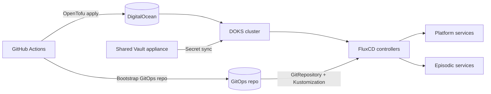

# Infrastructure design

Status: Draft (2025-12-26)

## Executive summary

This document defines the infrastructure blueprint for the episodic platform.
It codifies the Phase 0 foundation work, establishes the GitOps control plane,
and removes the manual setup steps currently implied by the roadmap.

The design is DigitalOcean-first and aligns with the Wildside infrastructure
patterns. OpenTofu provisions DigitalOcean Kubernetes Service (DOKS) clusters
and shared services, FluxCD reconciles the Git-based operations (GitOps)
repository, and GitHub Actions bootstrap both the cluster and the GitOps repo
without manual intervention.

## Goals

- Deliver a repeatable, fully automated bootstrap path for the GitOps repo and
  DOKS clusters.
- Establish environment parity (sandbox, staging, production) and a promotion
  model based on GitOps commits.
- Provide baseline platform services (ingress, Postgres, messaging, secrets,
  and observability) that later phases can depend on.
- Reuse Wildside infrastructure patterns where they fit without coupling the
  repos.

## Non-goals

- Application deployment mechanics beyond the GitOps repository layout.
- Detailed service sizing, cost optimisation, or capacity modelling.
- TLS, DNS, and certificate issuance beyond required Phase 0 decisions.

## Executive decisions

- Infrastructure as Code: OpenTofu.
- Integration testing: Terratest with ephemeral DigitalOcean resources.
- Kubernetes: DigitalOcean Kubernetes Service (DOKS).
- GitOps: FluxCD.
- Ingress: Traefik.
- TLS automation: cert-manager with Let's Encrypt.
- Postgres: CloudNativePG operator.
- Cache: Valkey operator (Redis-compatible) via
  <https://github.com/hyperspike/valkey-operator>.
- Messaging: RabbitMQ Kubernetes Operator.
- Secrets: SOPS (Secrets OPerationS) + age for GitOps, plus a shared Vault
  appliance with Wildside.

## Architecture overview

For screen readers: the diagram shows GitHub Actions provisioning DigitalOcean
resources with OpenTofu, bootstrapping a GitOps repo, and FluxCD reconciling
platform and application manifests into the DOKS cluster, with Vault providing
runtime secrets.



## Environments and promotion

- Environments: `sandbox`, `staging`, and `production`.
- Each environment maps to a dedicated DOKS cluster and a GitOps cluster path.
- Promotion happens by merging GitOps changes from `sandbox` to `staging` to
  `production`, preserving auditability through Git history.

## GitOps repository model

The GitOps repository is a single source of truth for platform and service
manifests. The bootstrap workflow enforces this layout on every run.

| Path                      | Purpose                                                     |
| ------------------------- | ----------------------------------------------------------- |
| `clusters/<env>/`         | Flux `Kustomization` roots and environment wiring.          |
| `platform/sources/`       | Flux `GitRepository` and `HelmRepository` sources.          |
| `platform/traefik/`       | Traefik HelmRelease and supporting manifests.               |
| `platform/cache/`         | Valkey operator and cache resources.                        |
| `platform/databases/`     | CloudNativePG operator and Postgres clusters.               |
| `platform/messaging/`     | RabbitMQ operator and cluster resources.                    |
| `platform/observability/` | OpenTelemetry Collector and telemetry backends.             |
| `platform/secrets/`       | SOPS-encrypted baseline secrets and ESO resources.          |
| `apps/`                   | HelmRelease or Kustomize definitions for episodic services. |

This layout mirrors the Wildside GitOps structure for predictability while
keeping the repository dedicated to episodic.

## OpenTofu structure and state

- OpenTofu modules are split by concern: `doks`, `fluxcd`, `traefik`,
  `cert_manager`, `cloudnative_pg`, `rabbitmq_operator`, and `valkey_operator`.
- Modules support a "render" mode that emits Flux-ready manifests into the
  GitOps repository, matching the Wildside pattern.
- State is stored in an encrypted remote backend (DigitalOcean Spaces) with a
  dedicated bucket per environment. Access is restricted to CI principals and
  backed by Vault-managed credentials.
- Sensitive outputs (kubeconfig, tokens) are not exported unless explicitly
  required for bootstrap and are rotated after use.

## OpenTofu module layout

The planned layout mirrors Wildside while keeping episodic-specific modules in
this repository.

```plaintext
infra/
  clusters/
    sandbox/
    staging/
    production/
  modules/
    cert_manager/
    cloudnative_pg/
    doks/
    fluxcd/
    observability/
    rabbitmq_operator/
    traefik/
    valkey_operator/
    vault_eso/
```

## Bootstrap automation (GitHub Actions)

Two GitHub workflows provide full, no-manual bootstrap coverage:

1. `bootstrap-gitops-repo.yml`
   - Creates or reconciles the GitOps repository under the target GitHub
     organisation.
   - Seeds the required layout, initial sources, and baseline platform
     manifests.
   - Generates a Flux deploy key and attaches it to the GitOps repo.
   - Enforces branch protection and required status checks.

2. `provision-doks.yml`
   - Runs OpenTofu plan/apply for the target environment.
   - Creates Virtual Private Cloud (VPC), DOKS cluster, node pools, and
     required DigitalOcean resources.
   - Installs FluxCD and configures it to track the GitOps repository path.

Both workflows must be idempotent and safe to re-run. GitHub Actions are tested
locally using act and pytest as defined in
`docs/local-validation-of-github-actions-with-act-and-pytest.md`.

## Cluster baseline

- DOKS clusters use a system node pool (Flux and platform services) and a
  workload node pool (episodic services), each with autoscaling enabled.
- Network policies restrict cross-namespace traffic by default.
- Traefik provides ingress and is configured via HelmRelease in the GitOps
  repository.
- cert-manager issues Transport Layer Security (TLS) certificates via Let's
  Encrypt.

## Platform services

- **Postgres:** CloudNativePG manages clusters, write-ahead log (WAL)
  archiving, and backups. Backups target S3-compatible object storage
  (DigitalOcean Spaces).
- **Messaging:** RabbitMQ Kubernetes Operator provisions the broker and manages
  users, vhosts, and TLS settings.
- **Cache:** Valkey operator provides Redis-compatible caching for platform
  services.

## Secrets and identity

- **Vault:** The HashiCorp Vault appliance is shared with Wildside and treated
  as an external dependency. The design assumes a follow-up project to move it
  into a standalone repo.
- **GitOps secrets:** SOPS + age encrypts repository secrets. The age key is
  stored in Vault and injected into Flux via External Secrets Operator (ESO).
- **Runtime secrets:** ESO syncs Vault KV entries into Kubernetes Secrets.

## Observability

Observability is OpenTelemetry-first with the following defaults:

- **Traces:** OpenTelemetry Collector receives OpenTelemetry Protocol (OTLP)
  traces and forwards to the configured backend.
- **Metrics:** Prometheus is the default in-cluster collector. InfluxDB remains
  an optional long-term metrics store.
- **Logs:** OpenSearch is the default log store; alternative backends must
  conform to OpenTelemetry log exports.

Phase 0 must define which backends are enabled per environment and publish
baseline dashboards and alert routes.

## Testing and validation

- Terratest integration tests provision ephemeral DigitalOcean resources with a
  strict naming prefix, environment tags, and automatic cleanup.
- GitOps bootstrap tests target the `df12-test` GitHub organisation.
- GitHub Actions are validated locally with act and pytest before Continuous
  Integration (CI).

## Dependencies and open questions

- Select the trace backend that OpenTelemetry Collector exports to.
- Publish the shared Vault contract (endpoints, CA bundle, auth method).
- Define the minimum Service Level Objectives (SLOs) and alert routing for the
  observability stack.
