# User's guide

The `tei-rapporteur` workspace currently focuses on establishing the crate
layout that underpins the rest of the roadmap. This guide summarizes what is
available today and how to exercise it.

## Workspace overview

- `tei-core` now models the top-level `TeiDocument` together with its
  `TeiHeader` and body-aware `TeiText`. The text model records ordered
  paragraphs (`P`), utterances with optional speaker references, and structural
  divisions (`Div`) containing paragraphs, utterances, lists (`List`/`Item`/
  `Label`), and nested subdivisions. Each `Div` keeps a required `@type`
  (`DivType`), an optional `@subtype`, an optional `@xml:id`, and an optional
  `Head` wrapper for a single leading `<head>` element in the Episodic profile.
  Each block stores a sequence of `Inline` nodes, allowing clients to mix plain
  text with emphasized `<hi>` spans and `<pause/>` cues without hand-rolling
  XML. Plain strings flow through `P::from_text_segments`,
  `Utterance::from_text_segments`, `Item::from_text_segments`,
  `Label::from_text`, and `Head::from_text`; the older `new` constructors
  remain as deprecated shims for existing callers where applicable.
  `TeiDocument` now exposes `validate()` to enforce document-wide rules: it
  rejects duplicate `xml:id` values across annotation systems, paragraphs,
  utterances, divisions, lists, and items, including nested divisions, and
  ensures utterance speakers appear in the profile cast when it exists. An
  empty cast still counts as declared, so every `who` fails until the speakers
  are populated, whereas the absence of a cast allows speaker references, so
  drafts can be validated incrementally. Identifier checks span the header as
  well, catching clashes between annotation systems and body blocks. Violations
  surface as `TeiError::Validation`. Utterances and list items now also carry
  local provenance and citation attributes where applicable, and XML
  deserialization remains strict for `<u>` and `<item>`: misspelt or
  unsupported attributes are rejected instead of being silently discarded.
- `tei-xml` depends on the core crate and now covers both directions of XML
  flow. `serialize_document_title(raw_title)` still emits a `<title>` snippet,
  `parse_xml(xml)` wraps `quick-xml` to materialize full `TeiDocument` values,
  and `emit_xml(&document)` now uses a hybrid emitter: header and stand-off
  sections are serialized via `quick_xml`, while body content is handwritten so
  mixed inline content and structural divisions round-trip correctly. All
  helpers return `TeiError`, so callers see consistent diagnostics whether
  parsing malformed input or attempting to emit control characters that XML
  forbids.
- `tei-serde` centralizes JSON and `MessagePack` serialization, allowing the
  rest of the workspace to depend on a stable wrapper API (`tei_serde::json`,
  `tei_serde::msgpack`) instead of taking direct dependencies on `serde_json`
  and `rmp-serde`. It also publishes a versioned JSON Schema snapshot for
  `TeiDocument` under `schemas/tei-document.schema.vX.Y.Z.json` (with
  `schemas/tei-document.schema.json` tracking the latest snapshot), generated
  from the `tei-core` Rust types via `schemars`. Schema generation is gated
  behind the optional `tei-core` Cargo feature `json-schema` so consumers that
  do not need schema publication can avoid pulling in `schemars`.
- `tei-py` now ships the `tei_rapporteur` PyO3 module. The exported `Document`
  class wraps `TeiDocument`, validates titles via the Rust constructors, and
  exposes a `title` getter plus an `emit_title_markup` convenience method. The
  module also surfaces a top-level `emit_title_markup` function so Python
  callers mirror the Rust helper without reimplementing validation rules. The
  MessagePack bridge exposes both `from_msgpack` and `to_msgpack` for binary
  interchange. Dictionary exchange is available via `from_dict`/`to_dict`,
  powered by `pyo3-serde`, so Python built-ins can cross the FFI boundary
  without detouring through JSON text. Phase 2.2 adds `parse_xml`/`emit_xml`
  bindings that forward TEI strings directly to the `tei-xml` helpers. Python
  can now parse canonical TEI without detouring through MessagePack, and
  emission always routes through the same forbidden-character guardrails as the
  Rust callers. Python-facing errors are surfaced as `ValueError` for content
  issues and `TypeError` when callers pass the wrong objects to the bindings.
- `tei-test-helpers` captures assertion helpers that multiple crates reuse in
  their unit and behaviour-driven tests.
- `pyproject.toml` configures `maturin` to build `tei-py`, allowing
  `maturin develop` or `maturin build` to work from the workspace root without
  additional arguments.

## Building and testing

Use the Makefile targets to work with the entire workspace:

- `make build` compiles every crate in debug mode.
- `make test` runs all unit tests and the behaviour tests powered by
  `rstest-bdd`.
- `make check-fmt`, `make lint`, and `make fmt` mirror the repository quality
  gates described in `AGENTS.md`.
- `make json-schema` regenerates the published `TeiDocument` JSON Schema
  snapshots under `schemas/`.
- `make validate-xml` generates XML fixtures and validates them against the TEI
  Episodic Profile Relax NG schema using `jing`. This requires jing to be
  installed (see "External XML validation" below).

## Behavioural guarantees

`tei-core` and `tei-xml` ship behaviour-driven tests that exercise happy and
unhappy paths. Core scenarios validate that header metadata can be assembled,
that blank revision notes are rejected, and that the body model preserves
paragraph/utterance/division order while rejecting empty utterances and invalid
division types. Additional cases demonstrate inline emphasis, rend-aware mixed
content, pause cues with duration metadata, and ensure empty `<hi>` segments
are rejected. Division-specific tests cover `Div` construction with validated
`@type`, `List` and `Item` assembly, `Label` prefix content, `@n` and
`@corresp` attribute handling on items, and `xml:id` uniqueness checks across
nested division content. The XML crate now tests title serialization,
full-document parsing, and XML emission: feature files cover successful
parsing, missing header errors, syntax failures triggered by truncated
documents, as well as emission of canonical minimal TEI output and the error
surfaced when a document sneaks in forbidden control characters. These tests
run alongside the unit suite, so developers receive fast feedback when
modifying the scaffolding. The `tei-py` suite layers on `rstest-bdd` scenarios
for the Python module, covering successful construction of `Document` from a
valid title, rejection of blank titles via `ValueError`, round-tripping markup
through the module-level helper, both directions of the MessagePack bridge, and
the new XML exchange APIs. Behaviour-driven coverage now parses canonical TEI
fixtures, rejects malformed payloads, emits canonical strings, and proves
forbidden characters bubble up as `ValueError` with an actionable message. New
dictionary scenarios cover happy-path decoding, missing fields, blank titles,
and the `TypeError` raised when `to_dict` is called with the wrong object. New
validation scenarios assert that duplicate `xml:id` values are rejected and
that utterance speakers must be declared when a profile cast exists, while
documents without a cast still pass validation.

The `tei-serde` crate now publishes a versioned JSON Schema for `TeiDocument`.
Its unit tests assert that the checked-in schema snapshot stays in sync with
the generated output, and its behaviour tests validate both happy paths
(serialized documents satisfy the schema) and unhappy paths (missing required
fields and unknown inline properties are rejected).

The `tei-serde` crate also includes property-based tests using `proptest` to
verify round-trip integrity between formats. These tests generate arbitrary
valid `TeiDocument` instances and confirm that serialization to JSON,
MessagePack, and XML preserves equality when deserialized. The property-based
test suite complements the example-based tests by exercising edge cases that
handwritten fixtures might miss, such as documents with many blocks, deeply
nested inline elements, and titles containing punctuation. Run `make test` to
execute all tests, including the property suite.

## Python bindings

The workspace now provides a ready-to-build Python wheel. `pyproject.toml`
declares `maturin` as the build backend and targets `tei-py/Cargo.toml`, so the
workflow looks like:

```bash
python -m pip install --upgrade pip maturin
maturin develop  # builds and installs tei_rapporteur into the active venv
python -c "import tei_rapporteur as tr; print(tr.Document('Wolf 359').title)"
```

Within Python, `tei_rapporteur.Document` constructs a validated TEI document by
wrapping the Rust `TeiDocument`. The class exposes a `.title` property and an
`emit_title_markup()` method that mirrors the Rust helper. The module also
offers a top-level `emit_title_markup(title: str)` so scripting callers can
work without instantiating a document. Continuous Integration (CI) now builds
the wheel on Ubuntu, installs it via `pip`, and imports the module to ensure
the PyO3 glue remains healthy.

Python data classes now live in `tei_rapporteur.structs`. The submodule defines
`msgspec.Struct` projections (`Episode`, `TeiHeader`, `FileDesc`, `Paragraph`,
`Utterance`, `DivBlock`, `ListBlock`, `Item`, `Label`, `StandOff`, `SpanGroup`,
`Span`, and the citation-declaration types) that mirror the Python-facing Rust
projection. Inline nodes decode into plain Python objects, and TEI pointer-list
attributes such as `source`, `resp`, `corresp`, and `ana` are exposed as
`list[str]` instead of TEI's whitespace-separated attribute strings.
MessagePack emitted by `to_msgpack` decodes directly into these classes, and
encoding them feeds the payload straight back into `from_msgpack`.

Structural body content is exposed through tagged unions:

- `BodyBlock = Paragraph | Utterance | DivBlock`
- `DivContent = Paragraph | Utterance | ListBlock | DivBlock`
- `Event = DocumentStart | HeaderEvent | ParagraphEvent | UtteranceEvent
  | DivEvent | DocumentEnd`

`DivBlock` and streamed `DivEvent` values now expose `div_type`, optional
`subtype`, optional `head`, optional `xml_id`, and recursive `content`, so
chapter markers, guest-bio sections, and sponsor-read sections can be modelled
without flattening the hierarchy into paragraphs.

Citation metadata is split along TEI-native boundaries. Canonical citation
declarations live under `header.encoding_desc.refs_decl`, utterance-local
provenance stays on `Utterance`, and many-to-many overlays live in the optional
root `Episode.stand_off` layer via `SpanGroup` and `Span`.

Binary interchange is now supported through
`tei_rapporteur.from_msgpack(payload: bytes)`. The helper accepts the bytes
produced by `msgspec.msgpack.encode` (or any compatible encoder), decodes them
via `tei-serde` (wrapping `rmp-serde`), and returns a `Document`. Invalid
payloads raise `ValueError`, so Python callers receive a familiar exception
instead of a Rust-specific error type. This allows workflows such as:

```python
import msgspec
import tei_rapporteur as tei
from tei_rapporteur.structs import Episode, FileDesc, TeiBody, TeiHeader, TeiText

episode = Episode(
    header=TeiHeader(file_desc=FileDesc(title="Bridgewater")),
    text=TeiText(body=TeiBody()),
)
payload = msgspec.msgpack.encode(episode)
document = tei.from_msgpack(payload)
print(document.title)
```

The inverse helper, `tei_rapporteur.to_msgpack(doc: Document)`, serializes the
validated document into MessagePack bytes via `tei_serde::msgpack`. The
function returns Python `bytes`, making it trivial to persist the payload or
feed it straight into `msgspec.msgpack.decode` to hydrate a structured type.
Non-`Document` inputs raise a `TypeError`, giving users immediate feedback when
they miswire a call. A complete round trip therefore looks like:

```python
doc = tei.Document("Bridgewater")
payload = tei.to_msgpack(doc)
from tei_rapporteur.structs import Episode
episode = msgspec.msgpack.decode(payload, type=Episode)
```

For JSON-style hand-offs, `tei_rapporteur.from_dict(payload)` and
`tei_rapporteur.to_dict(doc)` use `pyo3-serde` to bridge Python built-ins and
the Rust `TeiDocument`. The helpers accept any mapping/sequence tree that would
be valid JSON, raising `ValueError` when required fields are missing or titles
are blank and `TypeError` when a non-`Document` is passed. The output of
`to_dict` matches what `msgspec.to_builtins` produces, so callers can stay with
native Python objects:

```python
doc = tei.Document("Bridgewater")
payload = tei.to_dict(doc)
assert payload["teiHeader"]["fileDesc"]["title"] == "Bridgewater"
round_tripped = tei.from_dict(payload)
```

When scripts already have TEI XML on disk, the new `tei_rapporteur.parse_xml`
and `tei_rapporteur.emit_xml` functions avoid redundant conversions.
`parse_xml` hands the string straight to the Rust parser, returning a
`Document` that holds the validated `TeiDocument`. `emit_xml` performs the
inverse operation and retains the forbidden-character guardrails enforced by
`tei-xml`. A typical round trip combining XML and Python struct manipulation
therefore looks like:

```python
from pathlib import Path
import msgspec
import tei_rapporteur as tei
from tei_rapporteur.structs import Episode

doc = tei.parse_xml(Path("episode.tei.xml").read_text())
payload = tei.to_msgpack(doc)
episode = msgspec.msgpack.decode(payload, type=Episode)
episode.title = "Wolf 359 Reissue"
doc = tei.from_msgpack(msgspec.msgpack.encode(episode))
xml = tei.emit_xml(doc)
```

The BDD tests now cover successful decoding, encoding, XML parsing, emission,
and the corresponding error paths, ensuring the entry points remain reliable as
the API expands.

For spoken-runtime estimation, use `tei_rapporteur.spoken_text_segments(xml)`
instead of traversing XML locally. The function accepts a complete TEI document
string and returns `tei_rapporteur.structs.SpokenTextSegment` objects with
`text`, `locator`, and `xml_id` fields. It includes performed text from `<p>`,
`<ab>`, `<l>`, direct `<u>` content, and standalone `<seg>` in spoken context.
It excludes speaker labels, stage directions, notes, lists, labels, headings,
references, bibliography, show-note divisions (`<div type="notes">`), TEI
header metadata, and stand-off metadata. Malformed XML and unsupported body
markup raise `ValueError`; the API never falls back to raw-text counting.

```python
import tei_rapporteur as tei

xml = """
<TEI>
  <teiHeader><fileDesc><title>Episode</title></fileDesc></teiHeader>
  <text><body>
    <sp>
      <speaker>Host</speaker>
      <p xml:id="line-1">Hello <seg>there</seg>.<note>cut?</note></p>
    </sp>
    <div type="notes"><p>Link dump.</p></div>
  </body></text>
</TEI>
"""

segments = tei.spoken_text_segments(xml)
assert segments[0].text == "Hello there."
assert segments[0].locator == "/TEI/text/body/sp[1]/p[1]"
assert segments[0].xml_id == "line-1"
```

### Document validation

The `Document` class exposes a `validate()` method that performs document-wide
integrity checks. It verifies that all `xml:id` values are unique across the
document (including annotation systems, stand-off span groups, stand-off spans,
paragraphs, utterances, divisions, lists, and items), that utterance speaker
references match the declared cast list when present, that `refsDecl` entries
keep their required `@match` and `@property` values, and that internal `#id`
pointers in utterance, item, and stand-off provenance attributes resolve
against existing identifiers.

```python
import tei_rapporteur as tei

doc = tei.from_dict(payload)
try:
    doc.validate()
    print("Document is valid")
except ValueError as e:
    print(f"Validation failed: {e}")
```

Validation raises `ValueError` with a descriptive message when:

- Duplicate `xml:id` values are detected across the document
- An utterance references a speaker not declared in the profile cast
- A speaker is referenced when the profile has an empty cast (an empty cast
  still counts as declared, so all speaker references fail until the cast is
  populated)
- A `citeStructure` or `citeData` declaration leaves a required attribute blank
- A `Div` leaves `@type` blank after trimming
- A stand-off `spanGrp` leaves `@type` blank after trimming
- A stand-off `span` omits both `@target` and `@from`, or uses `@to` without
  `@from`
- A `#`-prefixed pointer in `source`, `resp`, `corresp`, `ana`, `target`,
  `from`, or `to` does not resolve to a known `xml:id`

Documents without a profile cast allow speaker references without validation,
enabling incremental validation of draft documents.

### Correspondence pointers

`@corresp` values follow TEI pointer semantics. A value beginning with `#` is
an internal pointer and must resolve to an `xml:id` in the same TEI document.
Use this form only when the referenced node is materialized in the document.
Validation rejects unresolved internal pointers, so callers do not accidentally
ship dangling local references.

External identifiers such as `urn:...`, `tag:...`, or `https://...` may be used
when the target lives outside the TEI document. Repository-owned objects,
including Episodic reference-document revisions, should use an external
identifier in `@corresp` unless that object is also represented in the same TEI
document with an `xml:id`.

Guest biographies therefore link to their source reference revision as an
external correspondence:

```xml
<item corresp="urn:episodic:reference-document-revision:019e1368">
  <label>Ada Lovelace</label>
  Mathematician and computing pioneer.
</item>
```

`tei-rapporteur` currently supports `@corresp`, `@n`, and `xml:id` on list
items. `@source` on `Item` is not part of the public body model yet; it may be
considered later if callers need stricter provenance semantics beyond the
current correspondence link.

## Text Encoding Initiative (TEI) Episodic Profile schema

The TEI Episodic Profile is formally documented in an ODD (One Document Does it
all) specification at `schemas/tei-episodic-profile.odd`. This specification:

- Defines the exact elements and attributes permitted in the profile
- Includes Schematron rules for validation constraints such as unique `xml:id`
  values and speaker cross-referencing
- Can be processed by TEI tools (Roma, TEI Stylesheets) to generate Relax NG
  and Schematron schemas for external validation
- Ships with a pre-generated Relax NG schema at
  `schemas/tei-episodic-profile.rng`. Rust callers can retrieve it via
  `tei_xml::relax_ng_schema()` or write it to disk using
  `tei_xml::write_relax_ng_schema(path)` before invoking external validators
  such as `jing`.

The profile supports:

- **Header metadata**: title, speaker declarations, annotation systems,
  canonical citation declarations (`refsDecl` / `citeStructure` / `citeData`),
  revision history
- **Body structure**: paragraphs (`<p>`), utterances (`<u>`) with optional
  speaker attribution via `@who` plus local provenance attributes (`@n`,
  `@source`, `@resp`, `@cert`, `@corresp`, `@ana`), and thematic divisions
  (`<div>`) with `@type` (required and validated via `DivType`), optional
  `@subtype`, optional `@xml:id`, and an optional `Head` wrapper for a single
  leading `<head>` element. Divisions can contain paragraphs, utterances, lists
  (`<list>`), and nested divisions. Lists hold ordered items (`<item>`) that
  carry optional `@n` (numbering or timestamp metadata), `@corresp` (pointer
  list for cross-references), and `@xml:id`. Each item may include an optional
  label prefix (`<label>`) followed by inline content. Paragraphs, utterances,
  items, labels, and heads all store ordered `Inline` nodes; plain strings can
  be constructed via `P::from_text_segments`, `Utterance::from_text_segments`,
  `Item::from_text_segments`, `Label::from_text`, and `Head::from_text`. Lists
  are permitted within `<div>` elements only; `<list>` cannot appear directly
  as a child of `<body>` and must instead be wrapped in a `<div>`. Document
  validation also rejects duplicate `xml:id` values across nested division
  content and enforces declared-speaker checks when a profile cast is present.

### Building divisions

Use the root `tei_core` re-exports to assemble a division tree before wrapping
it in a document body block:

```rust
use tei_core::{Div, Head, TeiDocument, BodyBlock};

fn build_episode_doc() -> Result<(), tei_core::TeiError> {
    // Parent division.
    let mut parent_div = Div::new("segment")?;
    parent_div.set_subtype("chapter-markers")?;
    parent_div.set_id("ch-01".to_string())?;
    parent_div.set_head(Head::from_text("Chapter markers")?);

    // Nested child division.
    let mut child_div = Div::new("segment")?;
    child_div.set_subtype("cold-open")?;
    child_div.set_head(Head::from_text("Cold open")?);

    // Attach the child and wrap the parent as a body block.
    parent_div.push_div(child_div);

    let header = tei_core::TeiHeader::new(tei_core::FileDesc::from_title_str(
        "Episode outline",
    )?);
    let mut text = tei_core::TeiText::empty();
    text.extend([BodyBlock::Div(parent_div)]);

    let _document = TeiDocument::new(header, text);
    Ok(())
}
```

- **Stand-off overlays**: root-level `<standOff>` containers with
  `<spanGrp>`/`<span>` layers for many-to-many citation and analytical markup
- **Inline elements**: emphasis (`<hi>` with optional `@rend` attribute), pause
  markers (`<pause>` with optional `@dur` and `@type`)

See `schemas/README.md` for instructions on generating schemas and validating
documents. In this profile, canonical citation declarations belong in
`<encodingDesc><refsDecl>...</refsDecl></encodingDesc>`, while citation and
provenance overlays that target multiple body nodes belong in the root
`<standOff>` section.

## External XML validation

The library includes support for validating generated XML against the TEI
Episodic Profile Relax NG schema using external tools like `jing`. This
provides an additional layer of assurance that emitted documents conform to the
formal schema definition.

### Local validation

Run the validation target to generate fixtures and validate them:

```bash
make validate-xml
```

This generates XML fixtures exercising different profile features (minimal
documents, paragraphs, utterances, and comprehensive documents with citation
declarations plus stand-off annotations), writes the embedded Relax NG schema,
and validates each fixture using jing.

The `validate-xml` target requires jing to be installed. On Ubuntu/Debian:

```bash
sudo apt-get install jing
```

On macOS with Homebrew:

```bash
brew install jing
```

### Continuous integration

CI automatically validates all XML fixtures against the Relax NG schema on
every pull request. This ensures that changes to the data model or emitter do
not produce invalid TEI documents. The CI workflow installs jing, generates
fixtures using the `generate-fixtures` binary, and validates each fixture.

### Fixture generation

The `tei-xml` crate provides a `generate-fixtures` binary that produces XML
fixtures for validation. The fixtures exercise different aspects of the TEI
Episodic Profile:

- **minimal**: Header with title only, empty body
- **paragraphs**: Body containing `<p>` elements with `xml:id` attributes
- **utterances**: Profile with speakers, body with `<u>` elements referencing
  speakers via `@who`
- **div-list**: Body containing `<div type="...">` elements with nested
  `<list>`, `<item>`, and `<label>` children
- **guest-bios**: Body containing `<div type="guest-bios">` with nested
  guest-biography items whose `@corresp` values point at external reference
  revisions
- **comprehensive**: All profile features combined (synopsis, speakers,
  languages, annotation systems, revision history, mixed body content including
  divisions)

Run the binary directly to generate fixtures to a custom location:

```bash
cargo run --package tei-xml --bin generate-fixtures -- /path/to/output
```

The generated XML includes the TEI namespace declaration required for schema
validation.

## Streaming parser (experimental)

For processing very large TEI documents without loading them entirely into
memory, the `streaming` feature enables incremental parsing via a pull-parser
interface.

### Enabling the feature

Add the `streaming` feature to the `tei-xml` dependency:

```toml
[dependencies]
tei-xml = { version = "0.1", features = ["streaming"] }
```

### Usage

The `TeiPullParser` implements `Iterator`, yielding `TeiEvent` values as it
processes the document:

```rust
use std::io::BufReader;
use std::fs::File;
use tei_xml::streaming::{TeiPullParser, TeiEvent};

fn process_tei(path: &str) -> Result<(), Box<dyn std::error::Error>> {
    let file = File::open(path)?;
    let reader = BufReader::new(file);
    let parser = TeiPullParser::new(reader);

    for event in parser {
        match event? {
            TeiEvent::DocumentStart => println!("Parsing started"),
            TeiEvent::Header(header) => {
                println!("Title: {}", header.file_desc().title().as_str());
            }
            TeiEvent::BodyBlock(block) => println!("Received block: {block:?}"),
            TeiEvent::DocumentEnd => println!("Parsing complete"),
        }
    }
    Ok(())
}
```

For string slices, use the convenience constructor:

```rust
let parser = TeiPullParser::from_str(xml_string);
```

### Event types

The parser yields four high-level event types:

- **`DocumentStart`**: Emitted once at the beginning of parsing
- **`Header(TeiHeader)`**: The complete header metadata, emitted once after the
  header section is fully parsed
- **`BodyBlock(BodyBlock)`**: A paragraph, utterance, or division from the
  body, emitted one at a time as each block is parsed. Division blocks are
  accumulated with their full child content (lists, items, nested paragraphs
  and utterances) before being yielded as a single `BodyBlock::Div` event
- **`DocumentEnd`**: Emitted once after all content has been successfully parsed

### Parser state overview

This diagram shows the main `InBody` to `InDiv` flow and the return paths from
`InHead`, `InParagraph`, and `InUtterance`.

```mermaid
stateDiagram-v2
    [*] --> InBody

    InBody --> InDiv : <div> start

    InDiv --> InHead : <head> start before children
    InDiv --> InParagraph : <p> start
    InDiv --> InUtterance : <u> start
    InDiv --> InDiv : nested <div> start
    InDiv --> InBody : </div> yields BodyBlock&#58;&#58;Div (top-level)
    InDiv --> InDiv : </div> pushes DivContent&#58;&#58;Div (nested)

    InHead --> InDiv : </head> stores heading on parent div

    InParagraph --> InDiv : </p> restores parent div
    InUtterance --> InDiv : </u> restores parent div
```



Full state coverage, including list, item, and label states, is documented in
the design document.

The streaming parser currently streams the header and body only. Root-level
`<standOff>` markup is supported by full-document parsing and emission, but it
is not yet emitted as a streaming event.

### Memory efficiency

The streaming parser yields body blocks one at a time, allowing processing of
documents larger than available RAM. The header is fully parsed before body
blocks begin, ensuring speaker declarations are available for validation. After
the `Header` event is yielded, the header is also accessible via the
`parser.header()` method.

### Error handling

Errors are returned through the iterator's `Result` type. If an error occurs
(malformed XML, unexpected structure, validation failure), the parser yields an
`Err` value and subsequent calls to `next()` return `None`.

### Python usage

The `tei_rapporteur` Python module exposes the same streaming iterator via
`iter_parse(xml: str)`. Events are returned as tagged dictionaries that decode
directly into the `tei_rapporteur.structs.Event` union:

```python
import msgspec
import tei_rapporteur as tr
from tei_rapporteur.structs import Event

xml = (
    "<TEI><teiHeader><fileDesc><title>Wolf 359</title></fileDesc></teiHeader>"
    "<text><body><p>Hello <hi rend='stress'>there</hi></p></body></text></TEI>"
)

for event in tr.iter_parse(xml):
    typed = msgspec.convert(event, type=Event)
    print(typed)
```

Events use internal tagging (`type`), covering:

- `document_start`
- `header` (with a structured `header` field)
- `paragraph` / `utterance` – carrying `content: list[Inline]` as tagged
  `Inline` values (`text`, `hi`, `pause`)
- `div` (carries `div_type`, `content: list[DivContent]`, and optional
  `subtype`, `head`, and `xml_id`; decodes into `DivEvent`)
- `document_end`

Inline content is also tagged (`text`, `hi`, `pause`), so Python callers can
type-check inline nodes without falling back to `Any`. Streamed utterance
events include the same local provenance fields as full `Utterance` structs:
`n`, `source`, `resp`, `cert`, `corresp`, and `ana`.

### Limitations

- The header is accumulated in memory before being deserialized, so documents
  with unusually large headers may still consume significant memory during that
  phase.

## Performance benchmarks

The workspace includes criterion benchmarks comparing the full-document parser
(`parse_xml`) with the streaming parser (`TeiPullParser`). These benchmarks
help quantify the performance characteristics of each parsing approach.

### Running benchmarks

```bash
make bench           # Run all parser benchmarks
make bench-memory    # Measure peak memory usage
```

Results are written to `target/criterion/` with HTML reports available at
`target/criterion/report/index.html`.

### Benchmark sizes

Benchmarks measure throughput (bytes/second) and latency for documents of
varying sizes:

Table: Dataset sizes and example transcripts

| Size       | Utterances | Paragraphs | Description                         |
| ---------- | ---------- | ---------- | ----------------------------------- |
| small      | 10         | 2          | Unit test baseline (~2 KB)          |
| medium     | 100        | 10         | Typical podcast transcript (~20 KB) |
| large      | 1,000      | 50         | Long-form interview (~200 KB)       |
| very_large | 10,000     | 200        | Multi-episode compilation (~2 MB)   |

### Interpreting results

- **Throughput**: Higher is better; measures parsing speed in bytes/second
- **Streaming advantage**: The streaming parser maintains constant memory
  regardless of document size, while the full parser scales linearly with
  document size
- **Latency trade-off**: The streaming parser may have slightly higher per-event
  overhead for small documents due to state machine transitions

### Memory profiling

For peak memory measurement, the `bench_memory` example can be run with
external profiling tools:

```bash
cargo build --release --package tei-xml --features streaming --example bench_memory
/usr/bin/time -v ./target/release/examples/bench_memory streaming
/usr/bin/time -v ./target/release/examples/bench_memory full
```

Compare the "Maximum resident set size" values to observe the memory advantage
of the streaming parser for large documents. The streaming parser processes
body blocks one at a time without accumulating them in memory, making it
suitable for documents that exceed available RAM.
